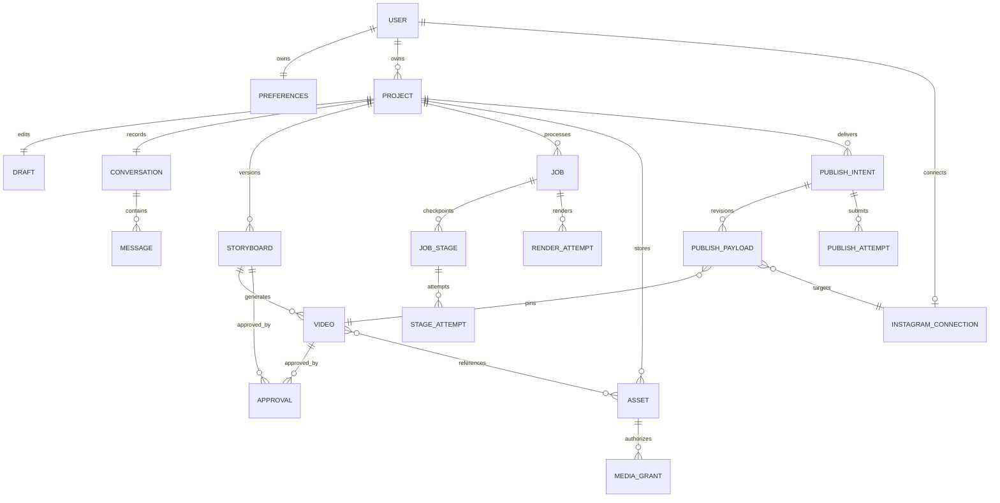
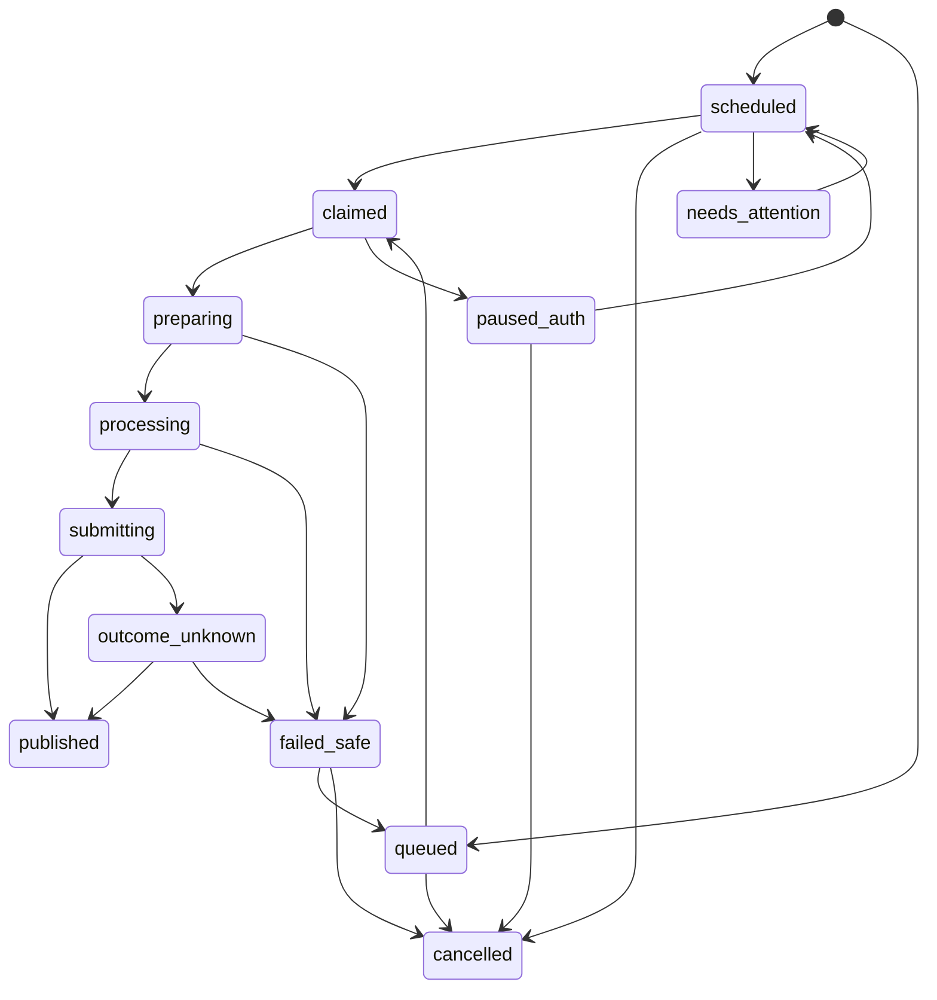

# NamasteVideo.ai — Database Design

Version 1.0 · September 26, 2026  
Status: Proposed MongoDB/R2 implementation contract; no database has been provisioned or migrated.  
References: [PRD](PRD.md), [system design](SYSTEM_DESIGN.md), [API contract](API_DESIGN.md).

## 1. Decisions and scope

MongoDB Atlas is the authoritative store for identity relationships, projects, mutable drafts, immutable content versions, approvals, jobs and publishing state. Private Cloudflare R2 holds binary media and larger derived JSON. Inngest delivers at-least-once workflow execution; it is not the business source of truth. Every user owns one personal workspace, represented by their auth user ID. There is no team membership/role graph.

Keep the approved system design, with these necessary persistence refinements:

1. `publishPayloads` stores immutable revisions; `publishIntents` stores current delivery state. Caption/time replacement preserves previous approval evidence.
2. `jobStages` owns each stage's current lease/fencing counter; `stageAttempts` records executions. A unique attempt ID alone cannot prevent two attempts executing the same stage concurrently.
3. `resourceSlots`, `rateLimitBuckets`, `serviceNonces` and `schemaMigrations` make operational locks, limits, replay defense and migrations explicit.
4. `conversations` owns a monotonically allocated message sequence. Chat arrays do not grow inside project records.
5. Instagram account reservation uses a partial unique index; disconnected records with missing account IDs must coexist.
6. User-content cleanup and unresolved provider-side actions have separate lifetimes. Content access is removed immediately, but minimal reconciliation evidence cannot disappear before an unknown outcome is resolved.

No billing collection, organization model, backup system, retention-policy engine or public signup is added. Operational TTL cleanup is not a backup/retention product.

## 2. Persistence conventions

### 2.1 Types and base fields

Notation in the schema tables: `?` means optional/absent, `| null` means explicitly nullable, and all other fields are required. `ID` is a prefixed opaque random string matching API rules; `UserID` is Better Auth's opaque string identity. `Hash` is 64 lowercase hex characters. `Date` is BSON UTC date, not a stored ISO string. `Int` means bounded integer represented consistently with BSON Int32; `Long` is BSON Int64 for byte counts or long-lived sequences. API serialization rejects values outside JS safe integer range. `Map`/objects have explicit nested schemas, never arbitrary client Mongo operators.

Every app-owned document has:

```typescript
type Base = {
  _id: ID;
  schemaVersion: 1;
  createdAt: Date;
  updatedAt: Date;
};
type Owned = Base & { ownerId: UserID };
type ProjectOwned = Owned & { projectId: ID };
```

Exceptions: auth-managed schemas follow the pinned adapter; pre-provision `internalAccess` has no owner yet; global resource slots/migrations/rate-limit records are service-owned. `outbox` carries ownerId/projectId when associated with content, but global maintenance events do not invent an owner. IDs are not secrets or access controls. No ObjectId/string mixing for application IDs. If the adapter uses BSON ObjectIds internally, expose its supported stable string user identity and use that consistently as ownerId; never guess conversions.

UTC times and counters are generated by trusted application/DB code. Clients cannot choose createdAt, ownerId, active slot, hash, approval actor, state or provider identities. No automatic lowercasing of narration. Normalize emails once with the same app/auth rule (trim + case-insensitive normalized form); do not strip dots/plus-tags. Keep display email separately in auth user data.

### 2.2 Validation layers

| Layer | Enforces |
|---|---|
| MongoDB `$jsonSchema` + selected `$expr` | Required fields, BSON types, enums, bounds, simple within-document relations |
| Unique/partial indexes | Single active project job, account reservation, command identity, sequence uniqueness |
| Service transaction/CAS | Ownership/reference consistency, allowed state transitions, draft revisions, approval and job creation |
| Domain validators | Exact cue resolution, semantic diagram constraints, narration/display mapping, timezone conversions |
| Render/media validation | Font layout, caption overlap, duration, codecs, audio integrity and artifact hashes |

Use `validationLevel:"strict"`, `validationAction:"error"` after clean migration. All writable objects enumerate allowed fields, including `_id` when `additionalProperties:false`. Draft fields have editing-friendly validation, but invalid drafts cannot be approved. Mongo validators do not enforce cross-collection foreign keys, compare old/new state, or prove text factual accuracy. Never describe a service rule as a native DB constraint. [MongoDB schema validation](https://www.mongodb.com/docs/manual/core/schema-validation/)

Do not allow application credentials to bypass validation or mutate indexes/validators in normal operation. An operator migration credential is separate. Better Auth collections retain its supported schema/index ownership; application migrations do not overwrite them with invented password/session formats.

### 2.3 Hash boundaries

Use canonical JSON with fixed numeric/text serialization and `canonicalizationVersion:1` before SHA-256. Never hash Mongo ordering, dates/status updates or volatile signed URLs as content. Inputs are normalized once before saving. Different hashes serve different purposes:

| Hash | Inputs |
|---|---|
| draft contentHash | Current saved topic/audience/notes/voice/editable plan; used for approval precondition |
| storyboard contentHash | Complete PlanV2 snapshot, including layout and notes references |
| storyHash | Spoken text/pronunciation, ordered semantic visual facts, source references and selected voice; excludes presentational size/position |
| speech fingerprint | Owner/project namespace, provider/model/resolved voice/settings, exact provider text, normalization version |
| renderSpecHash | Storyboard reference/hashes, visual overrides, caption overrides, compiler/component/font/build versions and audio references |
| outputHash | SHA-256 of actual encoded bytes |
| video approval subjectHash | Canonical `{outputHash,renderSpecHash}`; story approvals use storyHash |
| publication contentKey | Video ID, approved output hash, destination account/epoch and exact caption; excludes schedule time |
| payloadHash | Full immutable publication payload including mode/time and approval references |
| requestHash | Method/path + validated command body including preconditions; excludes tracing headers |

Excluding time from publication contentKey prevents two different schedules accidentally accepting the same video/caption under different keys. payloadHash records exactly which time was approved. These refine the system design's broad payload hash into two clearly distinct purposes.

## 3. Relationships



Relationships are logical, enforced by owner-scoped services and transactions. An asset's origin video may differ from a later video reusing it within the same project. R2 object keys and project prefixes do not replace these checks. No cross-project/cross-user speech reuse in V1. Account connection records retain their identity across credential updates; publication also pins provider account ID and destinationEpoch, so a mutable connection pointer cannot retarget an old intent.

## 4. Shared nested schemas

### 4.1 Plan and visual registry

Persist exactly API `PlanV2`: schemaVersion 2, title, audience, learningObjective, language `en`, voicePreset, sources and ordered scenes. Every scene contains stable ID, title/kicker, narration, pronunciation substitutions, visual component/version/data, semantic events and source IDs. Bounds and cue rules are in API section 4.2. Store component data under the corresponding schema, not a free-form object.

Initial registry contract (implement and test before enabling each capability):

| Component, version 1 | Data schema | Semantic checks |
|---|---|---|
| `title`, `takeaway` | `{labels:string[1..4]}`; each ≤30 chars | Text must correspond to approved narration |
| `flow` | `{steps:[{id,label}],edges:[{id,from,to}]}`; 2..4 steps, label ≤30; 1..6 edges | Unique IDs, valid endpoints, no unexplained reversal; edges' directions are semantic |
| `comparison` | `{left:{heading,points},right:{heading,points}}`; heading ≤18, 1..3 points each ≤26 | Compare same concept dimension; point value changes count as semantic |
| `binary-search` | `{values:int[3..9],target:int,step:int,mode:'setup'\|'compare'\|'result'}` | Distinct ascending 0..99 integers; lower midpoint; valid computed step; setup step 0; result final step; comparison needs midpoint + decision events |
| `water-overview`, `evaporation`, `condensation`, `rain`, `collection` | `{labels:string[1..4]}` each ≤30 | Only compatible water explanations; prototype components migrated by adapter |
| `diagram` | `{nodes:[{id,icon,label}],edges:[{id,from,to,label?}]}`; 1..6 nodes, ≤8 edges; labels ≤30 | Icon from bundled allowlist; references valid; no arbitrary SVG/path/url |
| `timeline` | `{items:[{id,label,position}],scale:'ordinal'\|'numeric',illustrative:boolean}`; 2..6 items; label ≤30; finite position | Ordered positions; numeric scale must reflect values; no invented historical fact |
| `chart` | `{kind:'bar',items:[{id,label,value}],unit,illustrative,sourceId}`; 2..6 items; label ≤20; finite 0..1e9 values | Explicit source or illustrative source record; common nonnegative baseline; numerical changes semantic |

Objects expose registry-defined target IDs for cue actions `reveal|emphasize|connect|compare|eliminate|found`, restricted per component. Actions must match component state; arbitrary action names fail. Full cross-scene binary-search example consistency (same values/target and coherent sequence) is checked in the application validator, not left to per-scene type validation. Chart inputs are finite numbers and never strings that execute expressions.

A render spec contains `{schemaVersion,storyboardId,storyHash,voiceConfig,visualOverrides,captionOverrides,compilerVersion,registryVersion,rendererBuildId,fontVersion,assetBindings}`. Override paths are allowlisted; JSON Patch can never change owner/state/provider configuration. Visual-only approval inheritance is permitted only when recomputed storyHash is unchanged and the source approval remains valid.

### 4.2 Reusable objects

- `SafeError`: `{code:string<=80,message:string<=500,retryable:boolean,correlationId:ID}`; optional safe provider code, never raw body.
- `VoiceConfig`: `{preset,provider:'elevenlabs',model,voiceId,settings:{stability,similarityBoost},normalizationVersion,testOnly,accent}`; floats bounded 0..1.
- `Lease`: `{holder:ID,until:Date,fence:Long}`; token increases under CAS, never supplied by user.
- `EncryptedSecret`: `{algorithm:'A256GCM',keyVersion,nonce:BinData,ciphertext:BinData,tag:BinData}`; associated data includes owner/connection ID and secret purpose. Key material lives outside MongoDB.
- `CaptionOverride`: `{sceneId,speechFingerprint,sourceStart:Int,sourceEnd:Int,displayText}`; half-open code-point span, end > start; nonoverlap/service-mapped to provider text.
- `QA`: `{passed:boolean,checks:{dimensions,duration,frameRate,videoCodec,audio,captionBounds,layout,integrity},durationSeconds:number,checkedAt:Date,validatorVersion}`. Readiness requires every required check true. Human approval is a separate record.

## 5. Collection schemas

Every table inherits Base/Owned/ProjectOwned as specified. Additional fields are forbidden unless migrated. Optional fields are absent rather than inconsistently null, except where null is explicitly listed. Public DTOs map absence to documented API nulls.

### 5.1 Identity and preferences

| Collection/base | Fields and constraints |
|---|---|
| Auth managed | Pin Better Auth adapter version; manage user/account/session/verification through supported APIs. Never store plaintext passwords, manually invent password hash formats or expose session tokens. Use adapter-owned indexes and expiry behavior. |
| `internalAccess` / Base | normalizedEmail:string≤254 unique, enabled:boolean, provisionedUserId?:UserID, provisioningState:`pending\|active\|disabled`, operatorRef:string; enabled alone does not imply account exists |
| `preferences` / Owned | revision:Int≥1, timezone:IANA string≤100, defaultVoicePreset:string≤64 |

Provisioning spans the external auth API and application metadata: make it idempotent by normalized email, mark pending, create/find through the supported API, then link the exact user and activate. Do not claim a Mongo transaction covers a separate auth API call. Admission requires enabled+linked user. Failure remains pending for operator retry without creating multiple accounts.

### 5.2 Projects, drafts and conversations

| Collection/base | Fields and constraints |
|---|---|
| `projects` / Owned | title:string1..100, revision:Int≥1, draftRevision:Int≥1, conversationId:ID, currentStoryboardId?:ID, latestReadyVideoId?:ID, selectedVideoId?:ID, activeJobId?:ID, deletedAt:Date\|null, flags:{drafts,ready,scheduled,published,needsAttention:boolean}, contentRevision:Long≥1 |
| `drafts` / ProjectOwned | revision:Int≥1, topic:string≤2000, audience:string≤200, notes:string≤20000, voicePreset:string≤64, editablePlan:DraftPlanV2\|null, sourceStoryboardId?:ID, planStale:boolean, contentHash:Hash, canonicalizationVersion:1, validationIssues:FieldIssue[0..100] |
| `conversations` / ProjectOwned | kind:`project`, nextSequence:Long≥1 |
| `messages` / ProjectOwned | conversationId:ID, sequence:Long≥1, operationId?:ID, role:`user\|assistant`, text:string≤12000, sourceStoryboardId?:ID, sourceVideoId?:ID, messageKey:string≤100 |

`DraftPlanV2` has the same structural safety constraints as approved PlanV2 but allows incomplete strings. Validate rendering eligibility separately. `draftRevision` on projects mirrors drafts.revision within the same transaction. `contentRevision` increments on related changes needed to fence deletion/state summaries, while metadata revision is reserved for user-facing rename/selection CAS.

`flags` is a materialized projection, not authority for authorization or posting. Update it in related transitions; an idempotent repair task recomputes from real records if necessary. Project filtered pagination uses the flag indexes below. No state is inferred from the existence of a file alone.

### 5.3 Immutable content and approvals

| Collection/base | Fields and constraints |
|---|---|
| `storyboards` / ProjectOwned | parentId?:ID, sourceDraftRevision:Int, content:PlanV2, contentHash:Hash, storyHash:Hash, canonicalizationVersion:1, state:`review_ready\|approved`, estimatedDurationSeconds:finite positive number, changeSummary?:string≤2000, changedSceneIds:string[0..10], warnings:FieldIssue[0..100], plannerConfig:{provider,model,promptVersion}, createdByJobId?:ID |
| `approvals` / ProjectOwned | kind:`story\|video`, subjectId:ID, subjectHash:Hash, approvedBy:UserID, approvedAt:Date, inheritedFromApprovalId?:ID, reason:`explicit\|visual_inheritance\|voice_change_confirmation`; inherited approval must point to same owner/project |
| `videos` / ProjectOwned | storyboardId:ID, storyApprovalId:ID, parentVideoId?:ID, renderSpec:RenderSpec, renderSpecHash:Hash, state:`building\|validating\|ready_for_review\|approved\|failed`, timelineAssetId?:ID, outputAssetId?:ID, outputHash?:Hash, qa?:QA, resolvedVoice:VoiceConfig, rendererBuildId:string, finalApprovalId?:ID |

The storyboard content, hashes and video render spec never mutate. Only lifecycle/result fields change under state guards. Every approved storyboard has a matching story approval; each approved video has a matching final approval of its output/spec. `finalApprovalId` is absent until explicit review. An inherited story approval is a separate audit record; final video approval is never inherited.

All approved references must survive until dependent schedules resolve. Selecting another storyboard/video does not revoke historical approvals or rewrite old delivery payloads. Regeneration creates a new video, even if identical text and voice configuration are used.

### 5.4 Jobs and checkpoints

| Collection/base | Fields and constraints |
|---|---|
| `jobs` / ProjectOwned | type:JobView.type from API, state:JobView.state from API, revision:Int≥1, stage:JobView.stage from API, activeSlot?:true, inputSnapshot:discriminated frozen object, inputHash:Hash, executionAttempt:Int≥1, cancellationRequestedAt?:Date, progress:{completedScenes?:Int,totalScenes?:Int,renderPercent?:number0..100}, result?:JobResult, error?:SafeError, inputRequest?:InputRequest, deadlineAt:Date, finishedAt?:Date |
| `jobStages` / ProjectOwned | jobId:ID, stageKey:string≤100, state:`pending\|leased\|request_started\|outcome_unknown\|succeeded\|failed\|cancelled`, fingerprint:Hash, currentAttemptId?:ID, fence:Long≥0, lease?:Lease, artifactIds:ID[0..30], error?:SafeError |
| `stageAttempts` / ProjectOwned | jobId:ID, stageId:ID, attemptNumber:Int≥1, fence:Long≥1, fingerprint:Hash, state:`started\|request_started\|succeeded\|failed\|outcome_unknown\|cancelled`, providerRequestId?:string≤200, outputKeys:string[0..30], artifactIds:ID[0..30], startedAt:Date, finishedAt?:Date, error?:SafeError |
| `renderAttempts` / ProjectOwned | jobId:ID, videoId:ID, stageId:ID, fence:Long≥1, attemptNumber:Int≥1, sandboxId?:string, commandId?:string, state:`allocating\|running\|uploading\|validating\|succeeded\|failed\|stopping\|stopped\|outcome_unknown`, rendererBuildId:string, deadlineAt:Date, resultManifestKey:string, slotId:ID, lastObservedAt?:Date, error?:SafeError |

Stage keys are deterministic: `plan`, `speech:<sceneId>`, `compile`, `render`, `validate`, `finalize`. A render rerun gets a new attempt, not a new input hash. Job input snapshots persist source IDs/hashes/configuration and planning input text when needed; no pointer to a mutable latest draft. Planning text is deleted with project content. The bounded snapshot is ≤128 KiB.

A job in queued/running/cancel_requested has activeSlot true, except cleanup jobs, which never block on the content slot and can run while cancellation resolves. needs_input/failed/cancelled/succeeded unset it. Reusing a terminal job for an explicit retry increments executionAttempt and revision, claims the project slot anew and clears terminal error/result as appropriate; attempt history stays intact. Narration corrections requiring a new approval create a new job instead.

### 5.5 Assets and media grants

| Collection/base | Fields and constraints |
|---|---|
| `assets` / ProjectOwned | kind:`audio\|alignment\|timeline\|captions\|thumbnail\|preview\|video\|qa`, originVideoId?:ID, originJobId:ID, objectKey:string≤1024, state:`staging\|ready\|deleting\|deleted`, sha256?:Hash, bytes?:Long≥0, contentType:allowlisted MIME, producerFingerprint:Hash, metadata:{durationSeconds?,width?,height?,fps?,codec?}, readyAt?:Date |
| `mediaGrants` / Owned | projectId?:ID, assetId:ID, tokenHash:Hash, purpose:`preview\|download\|ingest\|render_input\|render_output\|voice_sample`, intentId?:ID, attemptId?:ID, expiresAt:Date, revokedAt?:Date |

A ready asset requires hash, positive byte count and verified allowed metadata. No user-supplied object keys. R2 keys are immutable per attempt; never overwrite an approved video's object. Derived JSON also gets checksums/contentType and schemaVersion inside the file.

Configured voice samples are service-managed catalog assets outside user projects. Model them in a distinct `voiceSamples` collection: Base + preset, voiceConfigurationHash, objectKey, sha256, bytes, contentType, enabled. For purpose voice_sample, mediaGrant.assetId refers to this catalog and requires projectId absent. Other purposes require same-owner project asset. This explicit exception prevents a fake “public” project or accidental cross-user access. Render-output grants bind exact attempt/object operation and cannot authorize reads of unrelated files.

### 5.6 Commands, events and operational records

| Collection/base | Fields and constraints |
|---|---|
| `commands` / Owned | projectId?:ID, scope:string≤300, idempotencyKey:string16..128, requestHash:Hash, state:`accepted`, responseStatus:Int, responseBody:bounded JSON≤32KiB, resourceIds:ID[0..10] |
| `outbox` / Base | ownerId?:UserID, projectId?:ID, eventId:ID, aggregateId:ID, eventType:allowlisted string, payloadIds:object, state:`pending\|leased\|sent\|dead`, attempts:Int≥0, availableAt:Date, lease?:Lease, sentAt?:Date, lastError?:SafeError |
| `resourceSlots` / Base | resource:`render_global\|speech_global\|owner_stage`, slotNumber:Int, ownerId?:UserID, attemptId?:ID, state:`free\|reserved\|active\|reclaiming`, lease?:Lease, deadlineAt?:Date, providerResourceId?:string |
| `rateLimitBuckets` / Base | subjectHash:Hash, action:string≤80, windowStart:Date, count:Int≥0, expiresAt:Date |
| `serviceNonces` / Base | serviceId:string≤80, nonceHash:Hash, expiresAt:Date |
| `schemaMigrations` / Base | migrationName:string unique, checksum:Hash, state:`running\|completed\|failed`, checkpoint?:bounded JSON, lease?:Lease, errorCode?:string |
| `diagnosticEvents` / Base | ownerId?:UserID, projectId?:ID, operationId?:ID, correlationId:ID, eventType:allowlist, stage?:string, durationMs?:Long≥0, safeErrorCode?:string |

Command receipt and domain creation commit together; an uncommitted receipt is not visible. A transient distributed admission lock may return COMMAND_IN_PROGRESS; do not persist ambiguous half-accepted commands. Never put bearer grant URLs in saved command responses. The access-grant API is not idempotent for this reason. OAuth Connect responses are also excluded from command receipts.

Outbox contains IDs only; input content remains in protected records. Lease expiry allows event redispatch, not repeated unguarded provider calls. Global render slots are pre-created (initially two). A render slot remains reserved until its remote process is confirmed stopped or its hard lifetime expires; a missed heartbeat does not free actual compute capacity. Owner uniqueness and slot fencing apply concurrently.

### 5.7 Instagram and publication

| Collection/base | Fields and constraints |
|---|---|
| `instagramConnections` / Owned | revision:Int≥1, state:`connected\|expiring\|reconnect_required\|disconnected`, instagramUserId?:string≤100, username?:string≤100, accountType?:`BUSINESS\|CREATOR`, scopes:string[0..20], encryptedToken?:EncryptedSecret, expiresAt?:Date, tokenRevision:Int≥1, destinationEpoch:Int≥1, refreshLease?:Lease, reconciliationOnly:boolean |
| `oauthStates` / Owned | stateHash:Hash, initiatingSessionHash:Hash, returnProjectId?:ID, state:`pending\|exchanging\|consumed\|failed`, expiresAt:Date, consumedAt?:Date |
| `publishIntents` / ProjectOwned | revision:Int≥1, payloadId:ID, payloadRevision:Int≥1, videoId:ID, instagramUserId:string, contentKey:Hash, state:API PublishState, unresolved:boolean, dueAt:Date, retryDeadlineAt:Date, claim?:Lease, submissionBarrier:boolean, nextCheckAt?:Date, publishedAt?:Date, providerMediaId?:string, permalink?:string, error?:SafeError |
| `publishPayloads` / ProjectOwned | intentId:ID, revision:Int≥1, videoId:ID, videoApprovalId:ID, assetId:ID, outputHash:Hash, connectionId:ID, instagramUserId:string, usernameAtApproval:string, destinationEpoch:Int, caption:string≤configured limit, mode:`now\|schedule`, schedule?:{utc:Date,localTime:string,timezone:string,utcOffset:string}, approvedBy:UserID, approvedAt:Date, payloadHash:Hash, contentKey:Hash, supersedesPayloadId?:ID, repostOfIntentId?:ID |
| `publishAttempts` / ProjectOwned | intentId:ID, payloadId:ID, attemptNumber:Int≥1, fence:Long, phase:`container\|processing\|publish\|reconcile`, submissionState:`not_started\|request_started\|confirmed\|failed_safe\|outcome_unknown`, containerId?:string, requestStartedAt?:Date, providerMediaId?:string, permalink?:string, nextCheckAt?:Date, error?:SafeError |

`dueAt` is schedule UTC or accepted-at for now; retryDeadlineAt = dueAt + 15 minutes. A replacement payload updates these fields transactionally before claim. Timezone conversion validates offset, gaps and overlaps; BSON Date alone is insufficient to preserve what the user confirmed.

`unresolved:true` remains on scheduled/queued/claimed/preparing/processing/submitting/paused_auth/failed_safe/outcome_unknown/needs_attention. Only cancelled or published clear it. Keeping it for retryable failure prevents accidental second intents. A definite failure must be cancelled explicitly to abandon it. Published content requires deliberate repost acknowledgment; preserve contentKey history for duplicate lookup.

Disconnect keeps the provider account reservation while submitted outcomes remain unresolved, but sets reconciliationOnly and blocks new publish. Fully resolved disconnect erases token and unsets instagramUserId so it can be connected later. Different-account reconnect cannot overwrite a connection with unresolved submissions: return an actionable reconnect conflict until reconciliation completes. Pending unsubmitted schedules may be paused and explicitly replaced under the new epoch. This prevents losing the old token needed to resolve an external side effect.

## 6. Concrete document examples

These use readable JSON with RFC3339 dates for illustration; persistence converts them to BSON Date and Int/Long as specified. IDs/hashes are illustrative, not live records.

```json
{
  "_id":"prj_example000000001","schemaVersion":1,"ownerId":"user-example",
  "title":"Binary search","revision":1,"draftRevision":4,"contentRevision":8,
  "conversationId":"cnv_example000000001","currentStoryboardId":"stb_example000000001",
  "latestReadyVideoId":"vid_example000000001","selectedVideoId":"vid_example000000001",
  "deletedAt":null,"flags":{"drafts":false,"ready":true,"scheduled":true,"published":false,"needsAttention":false},
  "createdAt":"2026-09-26T10:00:00.000Z","updatedAt":"2026-09-26T10:05:00.000Z"
}
```

```json
{
  "_id":"pub_example000000001","schemaVersion":1,"ownerId":"user-example","projectId":"prj_example000000001",
  "revision":1,"payloadId":"pay_example000000001","payloadRevision":1,
  "videoId":"vid_example000000001","instagramUserId":"17841400000000000",
  "contentKey":"bbbbbbbbbbbbbbbbbbbbbbbbbbbbbbbbbbbbbbbbbbbbbbbbbbbbbbbbbbbbbbbb",
  "state":"scheduled","unresolved":true,"submissionBarrier":false,
  "dueAt":"2026-09-28T12:30:00.000Z","retryDeadlineAt":"2026-09-28T12:45:00.000Z",
  "createdAt":"2026-09-26T10:06:00.000Z","updatedAt":"2026-09-26T10:06:00.000Z"
}
```

```json
{
  "_id":"pay_example000000001","schemaVersion":1,"ownerId":"user-example","projectId":"prj_example000000001",
  "intentId":"pub_example000000001","revision":1,"videoId":"vid_example000000001",
  "videoApprovalId":"apr_example000000001","assetId":"ast_example000000001",
  "outputHash":"aaaaaaaaaaaaaaaaaaaaaaaaaaaaaaaaaaaaaaaaaaaaaaaaaaaaaaaaaaaaaaaa",
  "connectionId":"igc_example000000001","instagramUserId":"17841400000000000","usernameAtApproval":"example_creator","destinationEpoch":1,
  "caption":"Binary search, explained one step at a time.","mode":"schedule",
  "schedule":{"utc":"2026-09-28T12:30:00.000Z","localTime":"2026-09-28T18:00","timezone":"Asia/Kolkata","utcOffset":"+05:30"},
  "approvedBy":"user-example","approvedAt":"2026-09-26T10:06:00.000Z",
  "payloadHash":"cccccccccccccccccccccccccccccccccccccccccccccccccccccccccccccccc",
  "contentKey":"bbbbbbbbbbbbbbbbbbbbbbbbbbbbbbbbbbbbbbbbbbbbbbbbbbbbbbbbbbbbbbbb",
  "createdAt":"2026-09-26T10:06:00.000Z","updatedAt":"2026-09-26T10:06:00.000Z"
}
```

## 7. Index catalog

All collections have MongoDB's built-in unique `_id` index. Below are additional indexes with explicit key order. U = unique; P = partial filter. Do not mark absent/nullable IDs unique without a partial predicate. Partial uniqueness applies only to matching documents, and queries need compatible predicates to benefit from partial indexes. [MongoDB partial indexes](https://www.mongodb.com/docs/manual/core/index-partial/)

| Name / collection | Keys in order | Options / purpose |
|---|---|---|
| access_email / internalAccess | normalizedEmail:1 | U |
| access_user / internalAccess | provisionedUserId:1 | U, P `{provisionedUserId:{$type:'string'}}` |
| preference_owner / preferences | ownerId:1 | U |
| project_list / projects | ownerId:1, deletedAt:1, updatedAt:-1, _id:-1 | Default list |
| project_flag_* / projects | ownerId:1, deletedAt:1, flags.FIELD:1, updatedAt:-1, _id:-1 | One index per five dashboard flags; measure use before adding alternatives |
| draft_owner_project / drafts | ownerId:1, projectId:1 | U |
| conversation_project / conversations | ownerId:1, projectId:1, kind:1 | U |
| message_order / messages | ownerId:1, projectId:1, conversationId:1, sequence:1 | U; ascending pagination |
| message_once / messages | operationId:1, messageKey:1 | U, P `{operationId:{$type:'string'}}`; generated user/result message deduplication |
| storyboard_history / storyboards | ownerId:1, projectId:1, createdAt:-1, _id:-1 | History |
| approval_subject / approvals | ownerId:1, kind:1, subjectId:1, subjectHash:1 | U |
| video_history / videos | ownerId:1, projectId:1, createdAt:-1, _id:-1 | History |
| active_project_job / jobs | ownerId:1, projectId:1 | U, P `{activeSlot:true}` |
| job_recovery / jobs | state:1, deadlineAt:1, _id:1 | Deadline scan |
| job_project / jobs | ownerId:1, projectId:1, createdAt:-1 | Cleanup/history |
| stage_logical / jobStages | jobId:1, stageKey:1 | U |
| stage_recovery / jobStages | state:1, lease.until:1 | Stale stages |
| attempt_sequence / stageAttempts | stageId:1, attemptNumber:1 | U |
| render_sequence / renderAttempts | jobId:1, attemptNumber:1 | U |
| render_deadline / renderAttempts | state:1, deadlineAt:1 | Reconciliation |
| asset_key / assets | objectKey:1 | U |
| asset_reuse / assets | ownerId:1, projectId:1, kind:1, producerFingerprint:1, state:1 | Reuse only ready assets, not unique |
| asset_cleanup / assets | ownerId:1, projectId:1, state:1 | Deletion |
| sample_preset / voiceSamples | preset:1, voiceConfigurationHash:1 | U |
| command_key / commands | ownerId:1, scope:1, idempotencyKey:1 | U |
| command_cleanup / commands | ownerId:1, projectId:1 | Cleanup |
| outbox_event / outbox | eventId:1 | U |
| outbox_due / outbox | state:1, availableAt:1, _id:1 | Dispatch |
| outbox_lease / outbox | state:1, lease.until:1 | Abandoned dispatch |
| slot_global / resourceSlots | resource:1, slotNumber:1 | U, P `{resource:{$in:['render_global','speech_global']}}` |
| slot_owner / resourceSlots | resource:1, ownerId:1, slotNumber:1 | U, P `{resource:'owner_stage'}` |
| render_owner / resourceSlots | ownerId:1 | U, P `{resource:'render_global',ownerId:{$type:'string'}}`; retain reservation until compute gone |
| rate_bucket / rateLimitBuckets | subjectHash:1, action:1, windowStart:1 | U |
| rate_expiry / rateLimitBuckets | expiresAt:1 | TTL expireAfterSeconds:0 |
| nonce_once / serviceNonces | serviceId:1, nonceHash:1 | U |
| nonce_expiry / serviceNonces | expiresAt:1 | TTL 0 |
| migration_name / schemaMigrations | migrationName:1 | U |
| event_lookup / diagnosticEvents | correlationId:1, createdAt:1 | Debug |
| event_cleanup / diagnosticEvents | ownerId:1, projectId:1 | Content deletion scrub |
| connection_owner / instagramConnections | ownerId:1 | U |
| connection_account / instagramConnections | instagramUserId:1 | U, P `{instagramUserId:{$type:'string'}}` |
| connection_refresh / instagramConnections | state:1, expiresAt:1 | Refresh candidates |
| oauth_state / oauthStates | stateHash:1 | U |
| oauth_expiry / oauthStates | expiresAt:1 | TTL 0 |
| intent_due / publishIntents | state:1, dueAt:1, _id:1 | Scheduler |
| intent_history / publishIntents | ownerId:1, projectId:1, createdAt:-1, _id:-1 | Owner list |
| intent_unresolved / publishIntents | ownerId:1, videoId:1, instagramUserId:1, contentKey:1 | U, P `{unresolved:true}` |
| intent_reconcile / publishIntents | state:1, nextCheckAt:1 | Unknown/stalled outcomes |
| intent_account / publishIntents | ownerId:1, instagramUserId:1, unresolved:1 | Reconnect/disconnect checks |
| payload_revision / publishPayloads | intentId:1, revision:1 | U |
| payload_repost_lookup / publishPayloads | ownerId:1, contentKey:1, createdAt:-1 | Check previous confirmed publication by join to intent |
| publish_attempt_number / publishAttempts | intentId:1, attemptNumber:1 | U |
| publish_attempt_due / publishAttempts | submissionState:1, nextCheckAt:1 | Reconcile |
| grant_token / mediaGrants | tokenHash:1 | U |
| grant_expiry / mediaGrants | expiresAt:1 | TTL 0 |
| grant_revoke / mediaGrants | ownerId:1, projectId:1, revokedAt:1 | Revoke by parent |

Resource slot index clarification: use U `(resource,slotNumber)` with P `{resource:{$in:['render_global','speech_global']}}`; use U `(resource,ownerId,slotNumber)` with P `{resource:'owner_stage'}`. This allows each owner two stage slots without sharing global slot numbers. Use named indexes and compare actual options during migrations; `createIndex` is not a schema-upgrade strategy by itself.

For every additional project-owned collection without a project-prefixed index (approvals, jobStages, stageAttempts, renderAttempts, publishPayloads, publishAttempts), add `(ownerId:1,projectId:1,_id:1)` for bounded cleanup. Avoid TTL on commands, content, schedules or unresolved attempts. Expired TTL records may still exist; authorization checks dates explicitly.

## 8. State transitions and guards

### 8.1 Draft, storyboard and video

| Entity | Transition | Guard / writes |
|---|---|---|
| Draft | revision N → N+1 | expected revision + owner + live parent; update hash/issues and project mirror |
| Storyboard | review_ready → approved | exact content/story hash and explicit approval transaction |
| Video | building → validating | Current job/attempt fence, required artifacts complete |
| Video | validating → ready_for_review | All QA checks pass, output hash verified, parent not deleted/cancelled |
| Video | ready_for_review → approved | Exact output/spec hashes and explicit user approval |
| Video | building/validating → failed | Recorded definitive error; preserve old ready pointer |

No approved video changes back to building. Retry a failed build can create a new attempt on that video's immutable spec before it ever became Ready; regenerating an already ready/approved output always creates a new video ID. Storyboard selection/restoration is a project/draft operation, not history mutation.

### 8.2 Jobs and stages

Jobs: queued → running or cancelled; running → succeeded/failed/needs_input/cancel_requested; cancel_requested → cancelled (or definitive failure with cancellation recorded). Terminal failed/needs_input may return to queued only through an explicit valid retry on unchanged input; succeeded/cancelled cannot be blindly retried as the same job. Cleanup jobs remain observable until unresolved external actions finish.

Stages: pending → leased → request_started → succeeded/failed/outcome_unknown; leased may succeed directly for pure compile/validation stages. Expired leased stages may be re-leased with higher fence if no external request started. Expired request_started goes to reconciliation, never assumed safe. outcome_unknown → succeeded if saved artifact/provider evidence is recovered, or failed with explicit possible-repeat acknowledgment before a new attempt. Attempt history is append-only except terminal result fields.

### 8.3 Publication state machine



The diagram is representative; the exhaustive transition rules are:

- scheduled/queued claim only with due time ≤ now, no tombstone, current payload revision, valid ownership; increment claim fence.
- queued/scheduled/paused_auth/failed_safe/needs_attention can be replaced or cancelled only when submissionBarrier=false and no active claim. Replacement creates a payload and returns queued/scheduled as confirmed.
- claimed/preparing/processing can move to paused_auth or failed_safe only with positive evidence no publish submission occurred, clearing the claim safely. A processing timeout concerns a container, not necessarily a published post.
- immediately before media_publish, set submissionBarrier=true and attempt request_started atomically. submitting may only become published, outcome_unknown or positively confirmed failed_safe.
- outcome_unknown can become published or failed_safe only from authoritative evidence; expiration, absence from a list, and worker lease loss are not evidence of failure. Preserve barrier while uncertain.
- published/cancelled terminal; no automatic recreation. A new confirmed repost uses a new intent.
- after retryDeadlineAt with no submission, move to needs_attention. If already submitted, continue reconciliation without another publish call.

Cross-entity connection/token state changes never retarget payloads. Disconnect prevents new submission but cannot undo a barrier already crossed.

## 9. Transactions and atomic operations

Use a replica-set deployment supporting transactions. Native driver transactions use `readConcern:snapshot`, `writeConcern:majority`, primary read preference for these domain commands. Keep transactions short, perform writes sequentially, and do not call AI/Meta/R2 inside callbacks. Driver transaction retries can repeat callbacks; all IDs/hashes are prepared outside and the callback contains only database operations. [MongoDB Node transactions](https://www.mongodb.com/docs/drivers/node/current/crud/transactions/)

A parent read alone does not protect against concurrent deletion. Every command/worker commit that creates visible child state must conditionally write the live parent (`deletedAt:null`, increment contentRevision) in the same transaction. Deletion writes that parent too, producing a conflict instead of orphaned visible output. Periodic workers derive owner from stored records, never an event's claimed owner.

| ID | Transaction or atomic operation | Preconditions and writes |
|---|---|---|
| T01 Create project | Transaction | Receipt + project + blank draft + conversation; preference existence check/default snapshot |
| T02 Autosave/apply/restore | Transaction | CAS draft revision, live parent fence; update draft/hash, project draftRevision/currentStoryboard pointer, optional receipt |
| T03 Plan/revise admission | Transaction | Live parent, no active job; job immutable snapshot + activeSlot; conversation sequence allocation + user message; outbox + receipt |
| T04 Plan completion | Transaction | Job/attempt fence and live parent; insert candidate + deduped assistant message; finish job/release slot; never overwrite current draft |
| T05 Approve and generate | Transaction | Saved revision/hash valid, live parent/no slot; immutable storyboard as needed + approval + video + job; parent pointers, outbox, receipt |
| T06 Stage claim | Atomic CAS on jobStages, then attempt insert in same transaction | Eligible state, current fence, lease expiry rules; increment fence, create attempt, record currentAttemptId |
| T07 Stage completion | Transaction | Matching fence/currentAttempt, correct immutable fingerprint, parent live or cancelled-artifact path; ready asset refs + stage success + attempt result |
| T08 Video ready | Transaction | Required ready assets/QA + current job fence + no cancel/delete; video Ready and latestReady pointer; finish job and conditional active-slot release |
| T09 Video approval | Transaction | Same owner/project, ready bytes/spec hash; insert unique approval, video approved; receipt |
| T10 Retry/cancel | Transaction | Job revision and safe state; cancel request or new executionAttempt/active slot/outbox/receipt; no new input |
| T11 OAuth claim | Atomic state CAS | Hash/session/owner/expiry; pending → exchanging once; network exchange outside transaction; crash requires restart OAuth |
| T12 OAuth finalize | Transaction | Eligible unique account, no conflicting unresolved old submission, current token/epoch; connection upsert and state consumed; pause mismatched pending intents |
| T13 Accept/replace intent | Transaction | Approval/asset/destination match, live parent, revision/preclaim state; immutable payload + intent snapshot + contentKey guard + receipt/outbox |
| T14 Claim/cancel intent | Transaction | Same state/revision predicate; claim fence or cancelled terminal; update flags, revoke applicable grants; only one wins |
| T15 Publication submission barrier | Transaction | Current claim/payload, live parent, destination epoch and healthy connection, within deadline; attempt request_started + intent submitting/barrier; conditionally touch connection revision fence |
| T16 Record publish result | Transaction | Attempt/payload match; confirmed result or unknown; update intent, diagnostics and flags. Allowed after tombstone for reconciliation only. |
| T17 Delete project | Transaction | Owner+metadata revision; tombstone, cleanup job+receipt/outbox, request active job cancellation; subsequent worker commits blocked by parent fence |
| T18 Disconnect | Transaction | Connection revision; mark disconnected/reconciliationOnly, bump epoch for future authorization, pause unclaimed delivery, revoke grants; reconcile submitted attempts |
| T19 Reserve render slot | Transaction | Free global slot and no owner reservation; bind owner/attempt/fence; reserve before sandbox call |
| T20 Rate limit | Atomic increment/upsert | Unique bucket identity; increment and enforce threshold; TTL only storage cleanup |

T15 must perform a conditional write on the connection as well as the parent. Otherwise a snapshot read can race a disconnect and still publish using old credentials. This creates an explicit ordering: a completed barrier means publication may already happen; later disconnect/deletion cannot promise cancellation. T17 can revoke project access immediately via tombstone without synchronously updating thousands of grants; the gateway checks the parent. Cleanup scans then mark/remove grants and cancel pending intents in bounded batches. Scheduler T14/T15 checks the tombstone, so delayed batch cleanup cannot publish new work.

### 9.1 Illustrative active-job admission

```typescript
// Design pseudocode; all repository operations receive the same session.
await session.withTransaction(async () => {
  const project = await projects.findOneAndUpdate(
    {_id:projectId, ownerId, deletedAt:null, activeJobId:{$exists:false}},
    {$set:{activeJobId:jobId}, $inc:{contentRevision:1}}, {session}
  );
  if (!project) throw domainConflict('PROJECT_BUSY_OR_NOT_FOUND');
  await jobs.insertOne({...job, activeSlot:true}, {session});
  await outbox.insertOne(event, {session});
  await commands.insertOne(receipt, {session});
});
```

The real route distinguishes inaccessible parent from busy using owner-scoped reads without leaking another user. Unique partial index is a second safeguard, not a substitute for project state. On terminal completion, unset parent activeJobId only where it equals this job ID. An old attempt must not release a newer job's slot.

### 9.2 External effects and outbox

Transaction commits accepted job + outbox. Dispatcher claims due events, sends stable eventId, then marks sent. Crash after send can duplicate delivery; consumers inspect persisted operation state. Stale event delivery cannot reapprove inputs or rerun publication. Outbox retry exhausted → dead with alert, not lost silent work; operator/sweeper can redrive the same event identity after repair.

R2 upload happens outside MongoDB transactions, to deterministic attempt-specific keys. After upload, verify hash/size and commit asset readiness. A crash before DB commit can recover the object by its stored expected attempt key; an orphan is never inferred approved. No general two-phase commit with R2, ElevenLabs or Meta is claimed.

## 10. MongoDB validator example and invariant checks

Illustrative excerpt for jobs (the migration must include all schema fields from section 5):

```javascript
{
  $and: [
    {$jsonSchema:{
      bsonType:'object',
      required:['_id','schemaVersion','ownerId','projectId','type','state','revision','stage','inputSnapshot','inputHash','executionAttempt','deadlineAt','createdAt','updatedAt'],
      properties:{
        schemaVersion:{enum:[1]},
        state:{enum:['queued','running','cancel_requested','cancelled','succeeded','needs_input','failed']},
        revision:{bsonType:'int',minimum:1},
        executionAttempt:{bsonType:'int',minimum:1},
        activeSlot:{enum:[true]},
        deadlineAt:{bsonType:'date'}
      }
    }},
    {$expr:{$or:[
      {$eq:['$type','cleanup']},
      {$eq:[
        {$ifNull:['$activeSlot',false]},
        {$in:['$state',['queued','running','cancel_requested']]}
      ]}
    ]}}
  ]
}
```

This is deliberately labeled an excerpt, not an executable complete migration. Full validators must also enforce content shapes, job-type input unions, state-dependent result fields, prefix patterns, and maximum arrays. Immutability itself is enforced by restricted service updates and transactions, because a document validator cannot compare the previous value. Add within-document checks for `retryDeadlineAt >= dueAt`, end > start spans, ready-video required hashes/QA, published intent's confirmation evidence, and expiresAt > createdAt. Do not rely on validator excerpts as proof these are deployed.

Service invariant audit (read-only scanner, repair only safe projections): verify every active parent job exists and owns its slot; every ready video references ready same-project assets with hashes; every publish payload references a matching approval and destination; no terminal stage holds an unexplained compute reservation. Violations produce diagnostic events and block dependent actions. Never “repair” publication to published based on local assumptions.

## 11. Query patterns and performance

| Query | Predicate and ordering |
|---|---|
| Project list | ownerId + deletedAt:null + optional flag; tuple updatedAt/_id descending; limit+1 |
| Draft update | ownerId/projectId + exact revision; update and mirror in transaction |
| Storyboard/video history | ownerId/projectId + createdAt/_id cursor |
| Scene cache | ownerId/projectId/kind/fingerprint/state:ready; verify R2 checksum before reuse |
| Due delivery | state in scheduled/queued, dueAt ≤ now; small batches; claim each conditionally |
| Unknown delivery | state:outcome_unknown and nextCheckAt ≤ now; no blind publish retry |
| Account disconnect | ownerId/account + unresolved:true; pause only not-submitted; retain reconciliation references |
| Cleanup | ownerId/projectId and _id cursor; idempotent batches, no unbounded transaction |

Use projection to avoid returning notes/large plans in project cards. Do not run exact total counts for every page. Test indexes with explain on a realistic internal dataset; add indexes only for real access paths. No sharding initially. Reuse a bounded MongoClient connection pool per warm application instance and size it against Atlas limits; do not create a client per request.

Cap app JSON records at 256 KiB (job input 128 KiB, receipt 32 KiB) even though MongoDB permits larger documents. Put alignment, full timeline and QA detail files in R2; MongoDB retains searchable summaries and artifact IDs. Chart data and scenes remain bounded. Do not embed a full revision history or audit log within a parent.

## 12. Deletion, expiry, secrets and cleanup

- Tombstone first; all user reads and gateway authorization check parent.deletedAt. Already delivered bytes cannot be recalled.
- Request generation cancellation; deny late ready commits. Cleanup may retain late provider artifacts only until it safely deletes them, never restore them to UI.
- Cancel unclaimed publishing; preserve minimal provider/container IDs and reconciliation credentials for submitted outcomes. Physical content deletion waits only for the in-flight dependencies that genuinely need it.
- Delete same-project R2 assets in batches after writers stop; handle already-missing objects as success. Retry interrupted cleanup by persisted checkpoint. Delete grants, messages, drafts, versions and receipts after dependent external operations resolve. The cleanup receipt/status remains minimal and owner-readable until completion; later it may be purged by explicit project cleanup, with subsequent GET returning 404.
- Remove source text and captions from retained diagnostics; an external published post remains outside project deletion. No app action deletes it automatically.
- OAuth states, grants, nonces and rate-limit buckets use TTL. Do not TTL job evidence, approval hashes, unresolved attempts, or publication payloads while they are needed for safe recovery.
- Tokens use authenticated encryption, key version and unique nonce; master keys live in server secret configuration. Rotate by writing new ciphertext under CAS and retaining old decryption keys until re-encryption completes. Logs never contain raw secrets, prompt contents, gateway tokens or signed URLs.
- Database-wide loss has no V1 restore guarantee. Regeneration relies on surviving storyboard/configuration and generates a new reviewed version.

## 13. Migrations and prototype import

Migrations run via an operator command, not on every web request. Each migration has immutable name/checksum, lease, checkpoint and state. Refuse changed checksums for previously applied names. Prefer additive fields and dual-reader compatibility before enforcing required fields.

Sequence:

1. Pin driver/server/auth versions; test against a transaction-capable development replica set.
2. Create app collections, strict base validators and named indexes; apply auth schema through supported tooling.
3. Add fields with optional-compatible readers; backfill bounded batches under checkpoints.
4. Scan for duplicates/missing required data before unique indexes or strict validation. Resolve conflicts explicitly; never arbitrarily drop user records.
5. Deploy writers using the new version; then strengthen validation and remove legacy reader paths after jobs using old contracts finish.
6. Roll back application code only within supported schema compatibility. Irreversible content migrations need an explicit forward-fix strategy; no assumed backup restore.

Initial application collections use record schemaVersion 1 but PlanV2, intentionally separate. Prototype v1 import maps `type` to component ID, `cue` to event, search decisionCue to decision event, local speech paths to uploaded assets, and actual provider provenance to VoiceConfig. Recompute canonical hashes using the new contract and mark ready_for_review. Do not copy local approval hashes as app approval or create publish intents. Import requires explicit owner assignment and actual content/asset validation; synthetic fixtures remain labeled synthetic and are never publishable.

Generation retry may move a failed pre-ready video back to building only under an explicit retry transaction on its unchanged spec; ready/approved videos are never reopened. Database migrations do not upgrade rendering builds in-flight. Jobs pin compiler/registry/build and provider configuration; retain compatible artifact interpretation until those jobs terminate. Snapshot migration is a new version when it changes meaning, narration or final bytes.

## 14. Database acceptance tests

| Test | Required result |
|---|---|
| Two users, forged parent/child IDs | No foreign data read/written; no owner inference from IDs |
| Concurrent active jobs | Exactly one admitted per project; loser receives conflict |
| Concurrent draft saves | One CAS succeeds; no lost update |
| DB commit before event send failure | Outbox eventually dispatches accepted job |
| Duplicate event and stage takeover | No two current stage leases; stale fence cannot commit |
| Provider request started then crash | Outcome unknown, no automatic charged repeat |
| Late video commit vs deletion | Parent write conflict/tombstone prevents visible result |
| Two disconnected Instagram records | Allowed; two records reserving same account rejected |
| Disconnect vs submission barrier | Atomic ordering; no false guarantee of cancellation |
| Duplicate intent with changed schedule | ContentKey guard returns existing/conflict, not second delivery |
| Publish timeout then retry | Unknown state blocks resubmit until authoritative evidence |
| TTL record still present after expiry | Access denied synchronously |
| Partial unique index bypass attempt | Application validator/state guard rejects inconsistent flag/state |
| Render lease lost while sandbox alive | Slot not released until remote termination/expiry verified |
| Caption-only edit | Compatible speech preserved; fresh output approval required |
| Unicode cue/spelling offsets | Correct code-point↔provider mapping; no accidental UTF-16 shift |
| DST gap/overlap | Rejected or explicit valid offset persisted, never silent shift |
| Migration interruption | Resume from checkpoint; no duplicate import or altered applied checksum |
| Grant/project deletion | New gateway requests denied, content not restored by late worker |

Mongo integration tests must use real indexes, validators and transactions, not only mocked repositories. Test duplicate-key errors mapped to domain conflicts and inspect indexes after migrations. API contract tests serialize BSON safely and never expose encryption/session fields.

## 15. Requirement mapping and implementation boundary

| PRD requirement | Principal collections / rules |
|---|---|
| FR-01 | Auth, internalAccess, owner-scoped repositories and parent fences |
| FR-02 | drafts, conversations, messages, planning snapshots |
| FR-03 | storyboards, canonical hashes, approvals |
| FR-04 | timeline asset, QA duration gate |
| FR-05 | versioned registry/PlanV2 semantic validation |
| FR-06 | VoiceConfig, pronunciation mapping, speech fingerprint |
| FR-07 | caption overrides, speech mapping, caption/layout QA |
| FR-08 | parent version lineage, immutable content, revision rules |
| FR-09 | jobs, jobStages, attempts, outbox, resourceSlots |
| FR-10 | assets, QA, mediaGrants |
| FR-11 | oauthStates, instagramConnections, token encryption |
| FR-12 | publishIntents, publishPayloads, attempts and submission barrier |
| FR-13 | UTC/timezone/offset, due indexes and claim CAS |
| FR-14 | draft revisions, tombstones, cleanup jobs |

The next design activity is Google Stitch UI review using the API's explicit states. Neither this document nor the API document creates database resources, runs migrations, changes provider keys, publishes videos or begins frontend implementation. Build schema/route code only after the design phase moves to implementation.

## F05 implemented migration boundary — October 1, 2026

`001-foundation` retains its original schema definitions and checksum. The shared setup runner now also supports the additive, leased `002-projects` migration, run by `db:setup` and the disposable `auth:local` launcher. Runtime operations require the completed matching migration and required indexes and perform no schema administration.

- `drafts`: the documented base/owner/project fields, revision 1, blank topic/audience/notes, voice preference snapshot, null editablePlan, false planStale, canonicalizationVersion 1, SHA-256 contentHash of recursively key-sorted JSON for these restricted values, and empty validationIssues. The strict validator deliberately accepts only blank drafts until F07 installs a new migration for editable content; empty validationIssues is not approval eligibility. Unique `draft_owner_project` index on ownerId/projectId.
- `projectCommands`: project-scoped receipt for POST/DELETE with method, normalized path, SHA-256 keyHash/requestHash, accepted status and response snapshot. Unique `project_command_key` index on ownerId/method/path/keyHash; `project_command_parent` on ownerId/projectId. No short TTL. This slice-specific collection is not the future general jobs/outbox command implementation.
- Creation transaction: project + blank draft + conversation + receipt, with saved defaultVoicePreset snapshot or `daniel-test` fallback. No preference write or provider availability claim. Renaming increments project metadata/content revisions while leaving draftRevision unchanged.
- Empty-project deletion transaction: validate owner/live parent/revision and absence of later content, tombstone and scrub the title, increment revisions, clear flags, remove blank draft/conversation and scrub create response snapshots, then save the 204 deletion receipt. The minimal project/receipt tombstones retain no submitted title. Same-key deletion replay works; create replay for a deleted parent returns 404. No R2/provider cleanup or background job is implied.

Before editable drafts, messages or worker outputs are introduced, extend deletion with the durable cleanup transition described in this design and coordinate the API/client change. All future child writers must fence the live parent in the same transaction. Do not relax the F05 guard to silently delete populated projects.

## Implemented F07 draft persistence

Operator migration `003-idea-drafts` upgrades only the exact F05 blank-draft validator to editable topic/audience/notes and positive Int32 revisions. It preserves existing documents and `draft_owner_project` uniqueness. Historical migration checksums remain unchanged; replay of 002 recognizes the exact reviewed successor validator without downgrading it. Unknown validator drift or modified migration checksums fail closed. Run `npm run db:setup` with operator credentials; runtime API credentials do not execute collMod/index administration. The disposable local launcher runs this migration automatically.

The new migration uses the existing lease/fence ledger and checkpoints. Replay accepts the exact predecessor or successor; a crash after collMod can resume safely. This is a bounded validator relaxation; no data backfill or bulk deletion is performed. Storyboard fields remain constrained to null/false/empty issues. API validation reports STORYBOARD_REQUIRED, not approval readiness.

Draft PATCH transaction: read owner/live parent and draft → check expectedRevision and voice choice → update live parent with matching draftRevision (increment contentRevision, set draftRevision, drafts flag and updatedAt) → update matching draft revision/content/hash/time → commit. Child failure rolls back the parent write. Parent writes coordinate competing draft saves, metadata changes and deletion; transaction retries recheck ownership/live state/revisions. Metadata revision is not incremented by autosave. GET reads both documents in a snapshot transaction. No new indexes are needed for these owner/project lookups.

Edited projects continue to return PROJECT_DELETE_UNAVAILABLE. F07 does not relax the F05 deletion boundary or claim durable cleanup. Before later content writers or removal of this guard, implement the documented durable deletion lifecycle. Draft text remains plain user data; rendering/AI interpretation belongs to later features.

## F08b request receipts (October 2, 2026)

Migration 004 adds `ideaRequests` with owner/project, hashed idempotency key/body, model, source draft revision, state, bounded suggestions, safe error code, created/updated/deadline dates. Unique owner/project/keyHash and owner/project/createdAt indexes support replay and latest-request recovery. Prompt/context are sent to the provider from the saved draft snapshot, not persisted separately; the receipt contains only a request hash and result. This is not conversation history.

Admission and finalization transactions write the live parent contentRevision to fence deletion and use activeJobId as a project-wide slot. Expired running requests become unknown and release only their own matching slot. Completion requires the same live slot/request still running and unexpired; late results cannot overwrite a newer operation. Provider calls occur outside transactions and are never automatically retried. An expired request may have consumed usage; new work requires an explicit request. Receipt replay never invokes the provider. Existing drafts may change while suggestions run, but source revision is recorded and the UI refuses automatic application. Project deletion refuses any suggestion history until durable cleanup is implemented. No TTL removes retry receipts.


### F09a preparation, no database migration (October 2, 2026)

`apps/web/src/storyboards/contracts.ts` implements the first strict PlanV2 subset (title/takeaway/flow/comparison). The local planner probe writes private ignored JSON artifacts for inspection only. These are not database storyboard versions, approvals, hashes or job records. F09b must implement the reviewed immutable-candidate and ownership/fencing contracts before any storyboard HTTP API is exposed; do not relax the current draft validator or deletion guard as part of F09a. Planned registry components beyond this subset remain unavailable.

## F09b installed collections and transactions — October 2, 2026

Migration `005-storyboard-candidates` (`mig_storyboards000001`) follows 004. Operator `db:setup` and the disposable launcher install it; HTTP only verifies its checksum/indexes and never creates collections. Strict nested Mongo validators derive the bounded PlanV2 shape from the Zod contract. Application validation additionally checks cues, references, pronunciation, note provenance and duration. Mongo shape checks alone do not prove those semantic constraints.

- `storyboardRequests`: string job ID; schemaVersion 1; ownerId/projectId; sourceDraftRevision; model; SHA-256 keyHash and requestHash; running/completed/failed/unknown; nullable result storyboardId/errorCode; createdAt/updatedAt/deadline. Unique `storyboard_request_key` on `(ownerId,projectId,keyHash)` and `storyboard_request_latest` on `(ownerId,projectId,createdAt desc,_id desc)`. Permanent receipts, no TTL or provider inputs/raw responses. Request hash covers canonical `{method,path,body}`. Key hashing is SHA-256 of canonical JSON string; keys are namespaced to this collection/owner/project.
- `storyboards`: string stb ID; schemaVersion 1; ownerId/projectId/sourceDraftRevision; strict PlanV2 content; contentHash/storyHash/canonicalizationVersion 1; state restricted to review_ready; estimatedDurationSeconds 60–90 and wordCount 150–225; plannerConfig `{provider:gemini,model,promptVersion}`; createdByJobId; createdAt/updatedAt. History index `(ownerId,projectId,createdAt desc,_id desc)` and unique result index on `createdByJobId` ensure at most one candidate per receipt. Candidate fields are insert-only through the application. Mongo administrator privileges can still change data; no claim of database-level immutable documents is made. Approval and revision fields are deliberately not writable in this migration.

Canonical JSON recursively sorts object keys and retains array order; SHA-256 hashes UTF-8. contentHash includes the entire validated PlanV2. The current conservative storyHash projection includes every field except scene `events` (presentation actions/timing); it retains titles, kickers, learning objective, audience, ordered visuals/data, narration, pronunciation, sources/references and voice/language. There are no layout size/position fields in this subset. Changing this projection requires a new canonicalization version; hashes are not approvals or authorization grants.

Claim uses a snapshot/majority transaction: validate live owner parent and expected draft revision, snapshot draft fields, check prior receipt, claim activeJobId and increment contentRevision, insert running receipt. Provider calls occur outside transactions. Finalization rechecks live parent and deadline/slot, revalidates provider content against that snapshot, and atomically inserts candidate, completes receipt, releases matching slot and increments contentRevision. Draft revisions may advance while planning; the old result remains an immutable candidate, marked stale on read. No draft/content selection pointer is modified.

Both idea/storyboard services use `generation/live-project.ts` to expire bounded receipts in either collection and conditionally release only their own parent slot. Unknown outcomes have no stored candidate and may not transition back to completed. `running → completed|failed|unknown` are the only implemented transitions. Process crashes are recovered lazily by reading/replaying/admitting work after the deadline, not by a durable scheduler. F13 owns background execution.

Project empty-delete now rejects storyboard request/candidate history as well as edited drafts and active work. Every child write uses the parent write fence; every public candidate/history/receipt read verifies the live owner parent. There is no cleanup/backup/retention job in this slice. Future least-privilege database roles should grant candidate find/insert only until explicitly approved mutation semantics exist.


## Migration 006 — implemented storyboard queue

Migration `006-storyboard-queue` extends `storyboardRequests` with optional progress fields (`stage`, integer `attempt` 0–4, bounded string array `issueCodes`) without invalidating historical receipts or changing migration 005's checksum. Migration 005 recognizes the exact successor validator; replay remains safe. Migration 006 requires the original or exact successor schema and refuses unexpected drift.

New strict collection `storyboardQueue`: `_id` equals receipt ID (`job_` plus 32 hex characters); `ownerId`, `projectId`, `model`, `state` (`queued|running|done`), `createdAt`, `deadline`, and `draft` (bounded topic/audience/notes/voicePreset snapshot, or null). Required fields reject arbitrary extra properties. Default unique `_id` prevents duplicate queue commands. Indexes `storyboard_queue_work` on `(state, createdAt)` and `storyboard_queue_deadline` on `(state, deadline)` support claiming and cleanup. This is a private server collection, never returned through APIs.

Admission transaction writes the project fence, receipt and queue row together. Atomic findOneAndUpdate claims only queued, unexpired jobs. Provider calls run outside transactions. Finalization transaction validates the active fence and commits candidate, receipt completion and slot release together; queue state is marked done and draft cleared afterward. If that last cleanup fails, the receipt remains authoritative and the queue row is cleared at expiry without repeating provider work. Expiration uses existing conditional parent-slot release, so a late worker cannot displace a newer job. Deleted/inaccessible parents never publish results. Worker rechecks owner admission before and after provider execution.

State transitions: queue `queued → running → done`, or expired `queued/running → done`; receipt `running → completed/failed/unknown` is terminal. Running jobs are intentionally never reclaimed after crashes. Persisted queued jobs can survive worker restart but only until their original deadline. There is no TTL policy yet; done rows retain metadata while clearing draft content. Local disposable Mongo lifetime remains tied to auth:local. Persistent storage and hosted orchestration are separate deployment work.

Queue-expiry clarification (October 6, 2026): expiry atomically changes an unclaimed queue row from queued to done, clears its draft, marks its receipt failed/QUEUE_EXPIRED and releases the parent fence in the same transaction. A concurrent worker claim conflicts with this write; it cannot both dispatch and be classified as never started. Claimed or missing queue rows retain unknown-outcome handling. No schema migration is required.


## Migration 007 — Editable storyboard drafts (F10b1)

`007-editable-storyboard` upgrades only the exact migration-003 drafts validator, replacing null-only editablePlan with null or a strictly bounded PlanV2 draft. It permits incomplete display/narration strings, retains all array limits/enums/unknown-field rejection, makes planStale boolean and adds optional nullable sourceStoryboardId for compatibility with historical rows. Old migration checksums are unchanged. Migration runner successor checks now accept multiple explicitly known successors, so replaying 002/003/007 never downgrades the schema or resets data.

There is still one owner/project draft (`draft_owner_project` unique), using the existing shared draft/project.draftRevision and parent contentRevision fence. A working copy is stored only in drafts, never mutating storyboards. Canonical contentHash includes idea fields and editablePlan. The selected project.currentStoryboardId identifies its original immutable candidate, not a new immutable version of the edits. Clear sets editablePlan/sourceStoryboardId to null, planStale false and unsets that pointer. Validation is recomputed from the current draft on reads; the legacy validationIssues storage field stays empty and is not the source of truth.

New private collection draftCommands stores `_id` (cmd_ plus 32 hex), ownerId, projectId, hashed key, canonical request hash, exact DraftView response snapshot and createdAt. All fields required; extra top-level fields rejected. Unique index `draft_apply_key` on (ownerId, projectId, keyHash) scopes apply idempotency. It has no TTL, preserving retry protection. Admission checks live ownership, exact revision, candidate ownership/project/hash and matching voice. Draft replacement, parent revision/selected pointer and command insertion commit in one Mongo transaction. An insert/storage failure rolls back all three. No provider is called inside or outside that transaction.

Idea changes preserve working content and set a sticky stale flag. Applying an older source revision conservatively remains stale. Candidate creation/history remain immutable and retain their existing source-revision stale calculation. No approval records or immutable edited versions are created in this checkpoint. Populated-project deletion remains blocked pending the planned cleanup workflow, including these command snapshots.

### F11b1 revision command metadata — migration 008

Migration `008-storyboard-revisions` adds a strict private `storyboardRevisions` collection without changing historical validators/checksums. It requires the storyboard queue migration. All fields are required: `_id` is the accepted `job_` + 32 hex receipt ID, ownerId/projectId, sourceStoryboardId (`stb_` + 32 hex), sourceContentHash (64 hex), instruction (1–4,000 characters), nullable sceneId (stable scene-ID syntax), createdAt. Unknown fields fail validation. `_id` provides one metadata row per accepted revision; `revision_project_history` indexes `(ownerId,projectId,createdAt desc,_id desc)`. No TTL: the instruction and source lineage are private retained history, not transient provider logs.

Foreign-key checks are transactional application invariants: metadata owner/project match receipt/project/source; source hash is recomputed and scene scope must exist. Admission inserts metadata, existing storyboardRequests receipt, existing storyboardQueue idea snapshot and project activeJobId atomically. An insertion failure rolls everything back. Revision and generation receipts share the same owner/project/key uniqueness scope; canonical request hashes include their distinct route paths. Queue state remains queued → running → done, receipts running → completed/failed/unknown; existing deadline and late-result fences apply. No provider call is inside a database transaction.

The worker dereferences the immutable source by owner/project/ID, verifies its hash, and verifies command metadata against the accepted request hash before dispatch. Missing metadata cannot turn a revision request into a fresh generation. Completed results remain ordinary immutable storyboards; their createdByJobId links to revision metadata and the parent source. Read APIs derive parentId and differences from this relationship; these are not client-writable storyboard fields. Candidate/receipt/project-release completion stays atomic. Drafts and current selection are unchanged. Queue draft snapshots are cleared after completion/expiry; revision instructions/lineage remain for history. Existing project deletion remains unavailable for projects with storyboard history, as before; future cleanup must remove revision metadata as part of project cleanup. No separate message collection or immutable edited-source collection is implemented yet.

### F11b3 edited-source snapshots — migration 009

`009-storyboard-snapshots` adds strict private `storyboardSnapshots`: `_id` (job_ + 32 hex compatibility command ID), ownerId/projectId, keyHash/requestHash, result storyboardId, sourceStoryboardId/sourceContentHash and createdAt. All fields required; unknown properties rejected. Unique `storyboard_snapshot_key` on `(ownerId,projectId,keyHash)` provides permanent same-key replay; no TTL. Canonical request hash includes method, endpoint path and exact revision/hash body. Default _id uniqueness joins a manual candidate through the legacy `createdByJobId` field; this ID represents a synchronous snapshot command, **not** a provider/background job or storyboardRequests receipt.

The candidate validator permits plannerConfig.provider `manual` in addition to `gemini`. Manual rows use model `none`, promptVersion `manual-snapshot-v1`; content is still strict validated PlanV2. Migration 005 recognizes this exact successor schema without checksum changes or downgrade; migration 009 accepts only the known old/current validator. Existing generated records remain unchanged. Snapshot lineage is read through the command row and immutable parent candidate.

Creation reads live owner/project, draft revision/hash and non-stale valid editable plan; inserts candidate and command and increments parent contentRevision in one transaction. Parent write participates in the same conflict mechanism as autosave and job admission. A concurrent draft edit either follows the snapshot or causes its retry/precondition rejection. Insertion failure rolls back both records. Draft revision/content, selected candidate and active job remain unchanged; an active job blocks new snapshots. Historical replay is allowed before current draft/job preconditions. Snapshot content is immutable and has the captured draft revision, so later edits mark it stale on reads. Future project cleanup must include snapshot commands. This is version history, not backup or content approval.
