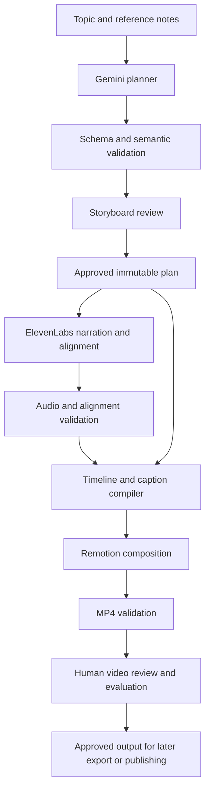

# NamasteVideo.ai — Pipeline Technical Design & Prototype Plan

Version: 1.0 · September 24, 2026  
Status: Original design with implementation updates below; three live narrated outputs and recovery checks now exist. See PROTOTYPE_STATUS.md for current evidence.  
Product baseline: [Final V1 PRD](./PRD.md)

## 1. Purpose and decision

Prove that the product can generate a useful 60–90-second educational explainer with minimal motion graphics, Indian English narration, readable captions, and precise synchronization before building the full application.

Build a local TypeScript pipeline with real Gemini and ElevenLabs adapters and a Remotion renderer. Use a command-line runner and static storyboard review artifacts initially. The prototype is a developer-operated proof of the production pipeline; it is not the final four-step dashboard.

Keep contracts and rendering components reusable in the Next.js application. Defer account UI, MongoDB persistence, hosted orchestration, R2 integration, and Instagram publishing until the core output has passed review. Their required boundaries are specified below so local implementation does not assume global shared data.

The first milestone is one complete, reviewable video. The prototype exit gate is three topics, both narrator presets evaluated, a local scene revision, a narrator change, and failure recovery. Neither a mocked provider response nor a silent animation demo counts as proof of live generation quality.

## 2. Prototype scope

### Included

- Topic and optional reference notes; English only.
- Gemini-generated structured storyboard and narration.
- Reviewable storyboard HTML plus JSON, with explicit approval of its hash.
- Two configurable Indian English narrator presets: male and female.
- ElevenLabs narration and returned alignment.
- Deterministic timeline compilation and caption grouping.
- Reusable explanatory animation components and a minimal fixed visual style.
- Vertical 1080 × 1920 MP4 at 30 fps, 60–90 seconds inclusive.
- Local artifacts, stage checkpoints, retry/resume, validation, and evaluation reports.
- One conversational revision interpreted into an updated structured plan, with targeted regeneration.

### Deferred to the application phase

- Next.js dashboard, authentication and user-facing voice picker.
- MongoDB Atlas, R2-backed storage, Inngest jobs, and hosted rendering.
- Instagram OAuth, publishing, and scheduling.
- Billing, backups, shared workspaces, public signup, and brand controls remain outside V1 entirely.

No arbitrary generated React/JavaScript execution, photorealistic video API, voice cloning, background music, or extra AI image provider is needed for this prototype.

## 3. Architecture



The planner decides what to explain and which supported visual elements communicate it. The compiler determines exact times from real audio. Remotion draws approved components at those times. Rendering must not call AI providers or introduce randomness.

### Initial implementation choices

| Concern | Initial choice | Boundary |
|---|---|---|
| Language | TypeScript on a supported Node.js LTS runtime | Pin actual runtime/package versions during setup |
| Planner | Gemini, configured initially as `gemini-3.8-flash` | Server-side provider adapter; validate account access |
| Narrator | ElevenLabs, initially `eleven_multilingual_v2` | Separate configured voice ID for each preset |
| Validation | Runtime schemas, with Zod as the proposed implementation | Provider JSON success is not application validation |
| Rendering | React components and Remotion renderer | Local Chromium/render runtime first |
| Artifact persistence | Filesystem artifact store | Replace with R2 adapter later |
| Run state | Local manifest with atomic writes | Replace with MongoDB/job records later |
| Scheduling | Sequential local orchestrator | Replace orchestration with Inngest later |
| Media inspection | Probe decoded media using available renderer/media tooling | Verify actual output, not only response metadata |

These model IDs are the current PRD baseline, not a promise of account availability. Fail preflight clearly if unavailable; record any model substitution and repeat affected quality checks.

## 4. Repository organization

Proposed layout; these folders are not yet implemented:

```text
src/
  contracts/       # Plan, approval, audio, alignment, timeline, manifest
  providers/       # Planner and speech adapters
  planning/        # Prompts, component catalog, plan/revision validation
  timing/          # Text normalization, alignment mapping, caption grouping
  video/           # Remotion composition, scenes, primitives, typography
  pipeline/        # Stage orchestration, checkpoints, invalidation
  storage/         # ArtifactStore interface and local implementation
  validation/      # Media and layout checks
  cli/             # Development commands
fixtures/         # Non-sensitive plans/alignment for deterministic tests
examples/         # Three evaluation topics and source notes
tests/            # Contract, compiler, dependency, integration checks
runs/             # Ignored generated artifacts; never contains API keys
```

Keep the pipeline independent of Next.js request objects. A later authenticated endpoint passes an owner-scoped job reference into the same pipeline functions.

## 5. Contracts and versioning

### Plan contract

Every plan contains:

| Field | Meaning |
|---|---|
| `schemaVersion` | Version of the supported document format |
| `projectId`, `ownerId`, `versionId`, `parentVersionId` | Ownership and immutable lineage; assigned by application code |
| `topic`, `audience`, `learningObjective` | Content intent |
| `language` | Fixed to English in V1 |
| `voicePreset` | `indian-english-male` or `indian-english-female` |
| `sources` | User-provided notes with stable references; no invented citations |
| `scenes` | Ordered scenes with stable IDs, narration, visual objects, and semantic cues |
| `warnings` | Unsupported or uncertain content requiring review |

Application code computes the canonical plan hash. Approval stores that hash, approving actor, and timestamp separately. Any meaningful plan mutation invalidates approval. The model cannot assign ownership, approve its own plan, choose arbitrary filesystem paths, or configure provider credentials.

### Scene contract

Each scene specifies a supported component type and typed parameters. A scene contains narration blocks, visual objects, and events. Narration blocks have stable IDs and approved text; pronunciation/display forms may differ but must retain an explicit mapping.

Example fragment, illustrative rather than a full video plan:

```json
{
  "id": "scene-water-heating",
  "type": "process-flow",
  "narration": [
    {
      "id": "line-heat",
      "text": "When water absorbs heat, its particles move faster."
    }
  ],
  "objects": [
    {"id": "water", "kind": "water-container", "label": "Water"},
    {"id": "heat", "kind": "heat-arrow", "label": "Heat"}
  ],
  "events": [
    {
      "id": "show-heat",
      "targetId": "heat",
      "action": "reveal",
      "cue": {"blockId": "line-heat", "phrase": "absorbs heat", "occurrence": 1},
      "offsetMs": 0,
      "durationMs": 400
    }
  ]
}
```

Objects and actions must come from a trusted registry. Phrase anchors must resolve uniquely using the stated occurrence. Reject missing/ambiguous cues; never silently bind them to the first similar phrase. Resolve character spans deterministically before calling speech generation.

### Compiled timeline contract

The compiler emits scene start/end frames, audio references, per-word timings, caption cues, resolved visual event frames, and composition settings. Include plan hash, audio content hashes, voice/model IDs, compiler version, component version, and font/asset versions.

Timing is derived data. The AI never invents final speech timestamps. Preserve caption display corrections independently of alignment so visual-only revisions do not erase them.

## 6. Speech strategy and synchronization

### Start with scene-level speech synthesis

Generate each scene as one speech request containing its narration blocks in a known order. This bounds alignment work and enables scene-level reuse. Keep the same voice, model, settings, and pronunciation conventions throughout the video.

Tradeoff: separate requests may sound discontinuous at scene boundaries. Listen specifically for changes in pace, energy, and intonation. If joins are consistently distracting, test whole-script synthesis as an explicit architecture experiment; do not silently change strategies. Whole-script synthesis improves continuity but broadens regeneration after edits.

### Alignment algorithm

1. Build the exact speech input and mapping from approved narration blocks to input character spans.
2. Save the provider’s audio and original/normalized alignment representations where returned.
3. Validate equal array lengths, finite nonnegative times, ordered starts, end ≥ start, and bounds against decoded audio duration.
4. Map provider text normalization to approved text. For number/acronym expansions, maintain many-to-many token mappings rather than assuming identical character offsets.
5. Resolve narration cues into timed word/phrase intervals.
6. Derive caption phrases and scene events from those intervals.
7. Stop with a recoverable alignment error if mapping is uncertain. In this prototype, retry is the initial recovery; an untested forced-alignment fallback is not required.

Repeated words, punctuation, Unicode apostrophes, acronyms, rupee amounts, decimals, and expanded numbers are mandatory test cases. If normalization cannot be reconciled, do not stretch guessed timings across the scene.

### Scene and frame accounting

- Use actual audio duration, not the timestamp of the final visible caption character, as the basis for scene length.
- At 30 fps, convert event starts using floor and ends using ceil, then validate each interval.
- Allocate each scene `ceil((audioDuration + approvedTrailingHold) * fps)` frames. Place each subsequent scene at the prior scene’s exact ending frame; avoid accumulating independent rounding errors.
- Play the scene audio from its compiled scene start. Preserve audio samples; do not repeatedly decode/re-encode intermediate speech if unnecessary.
- Use simple cuts initially. Within-scene reveals provide motion without complicated overlapping audio/transitions.
- Permit only small designed holds, initially 0–500 ms per scene, plus up to 1 second for the final takeaway. These are design defaults, not filler to force duration compliance.
- Final total must be 1,800–2,700 frames inclusive. If substantive wording needs to change to meet the range, return a revised plan for approval.

Human evaluation should check whether cues feel appropriate, not only whether their arithmetic is correct. The PRD’s approximately 200 ms timing target is a proposed tolerance for sampled phrase starts and intended visual events.

## 7. Captions and minimal visual system

Use high-contrast English captions with a maximum of two lines. Break on natural phrase boundaries using measured text width and actual audio timing. Avoid splitting a number from its unit or leaving a lone word on the next line when an alternative grouping fits.

Start with captions rendered as phrases without per-word animation. Keep the data word-aligned so highlighting can be added if evaluation demonstrates a benefit. Do not add a caption-style selector.

Use a light background, dark text, and two restrained accent colors. Package fonts locally for deterministic layout. Define reusable content and caption rectangles; safe-area coordinates are implementation defaults validated on phone previews, not claims about permanent Instagram overlay positions.

### Component build order

1. Shared typography, caption block, label, arrow, icon wrapper, and scene container.
2. Title/takeaway, process flow, and labeled diagram for the first complete video.
3. Comparison and step-sequence components for the second and third topics.
4. Timeline and chart as later V1 components; not required to pass the first-video milestone.

Each component consumes typed data, measures label fit, and animates from frame-derived values. No current-time APIs, unseeded randomness, network requests, or nondeterministic animation libraries inside rendering. Static storyboard previews use the same component at a representative frame.

## 8. Orchestrator, artifacts, and recovery

### Stage sequence

| Stage | Input | Output | Approval/retry rule |
|---|---|---|---|
| Preflight | Config and runtime | Capability report | No live generation on missing credentials/voices |
| Plan | Topic, notes, component catalog | Validated draft and review HTML | One bounded schema-repair attempt |
| Approve | Reviewed plan hash | Approval record | Explicit creator/developer review |
| Speech | Approved scenes and voice configuration | Audio and alignment per scene | Retry transient failures only |
| Compile | Audio, alignment, approved plan | Timeline and captions | Deterministic; fail on invalid mapping |
| Render | Compiled timeline and assets | MP4 and sample frames | Retry runtime failure without new speech calls |
| Validate | Encoded media and render report | Machine QA report | Invalid output cannot be Ready |
| Review | Video and QA report | Human scorecard | Final readiness requires human review |

Local manifest states: `draft`, `awaiting-approval`, `running`, `needs-input`, `failed`, `cancelled`, `ready-for-review`, `approved`. Record stage and scene status separately. Do not equate “file exists” with “stage succeeded.”

### Artifact layout

```text
runs/<owner>/<project>/<version>/
  manifest.json
  plan.json
  plan-review.html
  approval.json
  audio/<scene-id>.mp3
  alignment/<scene-id>.json
  timeline.json
  captions.json
  preview-frames/
  output.mp4
  qa.json
  evaluation.md
```

Write to temporary paths and atomically rename completed local artifacts. Hash completed artifacts and validate them on resume. Use one local writer per run. Save redacted stage diagnostics and timing, never secrets or authorization headers.

Reuse a speech artifact only if narration input, pronunciation mapping, voice ID, model, and relevant settings match. Reuse renders only if all timeline/assets/component/font dependencies match. Never reuse across owners in the application phase.

Transient provider failures get a bounded backoff policy, initially two retries honoring Retry-After when supplied. Invalid credentials, unsupported models, invalid input, and policy rejections stop immediately. A timed-out speech request may have incurred a provider charge; retry limits constrain duplication but do not guarantee provider-side idempotency.

Cancellation stops future stages. If an already-running provider request completes, record it as an artifact of the cancelled job without advancing approval. Missing media can be regenerated from the saved plan, creating a new version where output changes. No backup system is introduced.

## 9. Revision behavior

| Requested change | Required action |
|---|---|
| Larger labels in one scene | Validate new visual parameters, rebuild timeline if needed, rerender; reuse speech |
| Correct caption display spelling | Preserve audio; update display mapping and revalidate alignment/layout |
| Change spoken explanation | Create revised plan, obtain approval, regenerate affected scene audio/timing, recompile downstream positions |
| Change narrator | Keep approved narration, regenerate all speech/timing, render a new video for review |
| Reorder scenes | New plan approval; reuse compatible scene audio, rebuild global timeline |

The revision interpreter outputs a candidate plan, not imperative code. Compute a structural diff and validate that the requested scope was respected. Preserve the prior successful video until the revision passes validation. A future scheduled publish intent remains pinned to the old approved output until explicitly replaced.

## 10. Developer workflow and configuration

Proposed commands to implement; they are not currently executable:

```text
npm run pipeline -- preflight
npm run pipeline -- plan --topic-file examples/water-cycle.md --voice indian-english-female
npm run pipeline -- approve --run <run-id> --plan-hash <reviewed-hash>
npm run pipeline -- generate --run <run-id>
npm run pipeline -- resume --run <run-id>
npm run pipeline -- revise --run <run-id> --instruction-file <file>
npm run pipeline -- evaluate --run <run-id>
```

Preflight checks Node/render tooling, configured model/voice identifiers, available disk space, and local output access. Network authorization checks must be explicit and must not accidentally invoke paid generation.

Required for live AI tests:

```text
GEMINI_API_KEY
GEMINI_MODEL
ELEVENLABS_API_KEY
ELEVENLABS_MODEL
ELEVENLABS_VOICE_ID_INDIAN_MALE
ELEVENLABS_VOICE_ID_INDIAN_FEMALE
```

Store values in an ignored local environment file and later server environment settings. A committed `.env.example` contains placeholders only. R2, MongoDB, Meta, Vercel, and Inngest credentials are not prerequisites for the first local MP4.

Fixture mode should permit schema, layout, caption, and renderer work without credentials. Label fixtures clearly; never report them as live provider validation. Use a reviewed recorded alignment/audio fixture or a clearly marked silent timing fixture for plumbing tests.

## 11. Evaluation plan

### Three sample explainers

| Topic | Type | Required visual evidence |
|---|---|---|
| How the water cycle works | Process | Water, evaporation, condensation, and rainfall advance with narration |
| RAM versus storage | Comparison | Two distinct roles and a simple analogy; labels remain clear |
| How binary search finds a number | Abstract/algorithm | Sorted values, midpoint selection, and discarded half shown step by step |

Provide short verified reference notes for each topic. The prototype should not perform open-web research. State simplifications where needed—for example, binary search assumes sorted input.

Produce one complete output per topic; use the female preset for the first, male for the second, and either for the third. Then switch the narrator on one complete video and perform one scene-specific revision on another. These extra runs test dependency handling as well as voice quality.

### Machine checks

- Schema validity, unique IDs, permitted components, valid references, resolved cues.
- Approved hash matches input; artifacts and configuration provenance are complete.
- Speech is nonempty, decodable, and bounded; alignment arrays are valid.
- Timeline is contiguous, audio fits its scene, events stay in bounds, and captions do not overlap unexpectedly.
- MP4 has a video and audio stream, correct dimensions/frame rate, and 60–90-second duration.
- Font measurements fit caption and label boxes; inspect frames at cue boundaries and worst-case labels.
- Resume does not regenerate valid speech after a render failure.
- A visual-only edit does not trigger speech calls; a narrator change does.

### Human review

Score each criterion 1–5: explanation accuracy, visual relevance, motion timing, Indian English pronunciation, voice continuity, caption readability, and overall willingness to publish. Pass when each critical criterion is at least 4, with no factual error, omitted speech, unreadable label, or misleading diagram. These are prototype gates, not a claim that quality has already been achieved.

Listen on headphones and a phone speaker; view at phone size. Check names, acronyms, units, and pauses. Measure total elapsed time, stage durations, retry counts, and available provider usage; inspect costs in provider dashboards rather than building metering.

### Failure tests

- Invalid planner JSON, unsupported visual type, missing phrase anchor.
- Number normalization, repeated phrase, punctuation-only interval.
- Missing alignment, corrupt audio, truncated narration.
- Provider timeout/rate limit and invalid credentials.
- Render failure after speech completion; resume from saved artifacts.
- Narrator unavailable; no silent replacement.
- Edited plan after approval; reject stale approval.
- Concurrent local run attempt; refuse duplicate writer.
- Output outside duration range; return for plan adjustment instead of adding filler.

## 12. Implementation sequence

| Milestone | Work | Deliverable |
|---|---|---|
| P0 — Foundation | Runtime setup, schemas, config validation, manifests, artifact adapter | A deterministic fixture pipeline and useful preflight errors |
| P1 — Visual skeleton | Core components, captions, timeline compiler, local render | Clearly labeled fixture MP4 for layout/timing inspection |
| P2 — Live vertical slice | Gemini planner, approval checkpoint, ElevenLabs timing, real render | First complete water-cycle video and QA report |
| P3 — Quality and revision | Other topics, both voices, local revision, duration handling | Sample set, revised videos, voice comparison |
| P4 — Recovery and report | Resume/failure tests, stage timing, quality review | Prototype findings and architecture decisions |

P0/P1 can proceed without provider credentials. P2 requires configured API access and voice IDs. There is no reason to request all future production credentials before the local pipeline exists.

Do not start building the full dashboard merely because P1 renders successfully. Move to application implementation after reviewing the real P2/P3 outputs and addressing critical failures.

## 13. Transition to the full application

After the prototype gate:

1. Retain the plan/timeline contracts, provider adapters, validation, and visual components.
2. Replace local manifest storage with owner-scoped MongoDB records and filesystem assets with private R2 storage.
3. Wrap pipeline stages in Inngest with durable job identities and retry policies.
4. Benchmark Remotion on Vercel Sandbox, persisting final outputs to R2 before sandbox teardown.
5. Build the four-step Next.js UI and individual Better Auth accounts around the established contracts.
6. Add per-user Meta authorization and publishing with immutable approvals and unknown-outcome reconciliation.

Keep a parallel setup checklist for the Meta developer app, callback URLs, eligible test accounts, and permissions. It must not block local video-quality work or be mistaken for an implemented integration.

The subsequent system architecture document should specify database indexes, ownership enforcement, authenticated routes, job dispatch consistency, credential storage, R2 access URLs, hosted render lifecycle, and Instagram scheduling races. Incorporate measured prototype findings rather than inventing throughput and cost guarantees.

## 14. Prototype completion criteria

- Three real 60–90-second explainers produced and reviewed.
- Both Indian English voices evaluated; one full narrator-switch regeneration completed.
- At least one targeted scene revision completed with correct artifact reuse.
- Caption and animation synchronization validated against actual narration.
- Render failure recovered without unnecessary speech regeneration.
- Machine checks and human scorecards saved with outputs.
- Model/voice IDs, latency, limitations, and architectural changes recorded.
- Clear recommendation to proceed, improve the component library, or change a pipeline choice.

Original acceptance criteria are tracked in PROTOTYPE_STATUS.md. Indian narrator evaluation is deferred by user decision; full playback review of the latest two outputs is pending.

## 15. Official references checked for the design

- [Gemini structured outputs](https://ai.google.dev/gemini-api/docs/structured-output): schema-constrained planning responses; application validation remains necessary.
- [ElevenLabs speech with timing](https://elevenlabs.io/docs/api-reference/text-to-speech/convert-with-timestamps): narration with character-level alignment used by the timing adapter.
- [Remotion renderMedia](https://www.remotion.dev/docs/renderer/render-media): programmatic media rendering from a composition.

These sources establish provider capabilities, not the quality of this proposed pipeline. Exact SDK versions and account capabilities must be verified during implementation.


## Implementation decisions — September 26, 2026

- User approved the water-cycle visual direction and deferred premium Indian voices; Daniel remains the test narrator.
- Planner uses the stateless Gemini Interactions API. RAM used Gemini 3.5 Flash; binary search succeeded with an explicit 3.8 Flash override after 3.5 errors. The configured default remains 3.5. Runtime validation and factual review remain necessary.
- Three live narrated topics rendered: authored water cycle, Gemini RAM plus revision, and Gemini binary search plus operator review. RAM and binary search still await user playback feedback.
- Binary-search data is bounded to 3–9 sorted distinct integers. Trusted code computes midpoint and elimination; the AI supplies narration and exact phrase cues. Midpoint and decision events are separately aligned to speech.
- `edit-plan` creates a new reviewed revision with a new approval hash and compatible speech cache. A real visual-only revision reused seven clips with zero speech generation and preserved its source export.
- Injected renderer failure recorded failed state and released the lock; resume completed with provider calls disabled. A lingering-process bug was fixed and a separate fresh failure test verified automatic exit. Evidence is in the recovery reports listed in PROTOTYPE_STATUS.md.
- The implemented CLI has strict alignment matching, no automatic speech retries, and local run IDs. Rich normalization, application ownership, durable orchestration, cancellation UX, and some original design checks remain future work. README.md documents executable commands; earlier proposed schemas and layouts describe the target architecture.
- TypeScript and 23 tests pass. Next: use these findings in the application system architecture, then build the Next.js workflow. No dashboard has been implemented yet.
