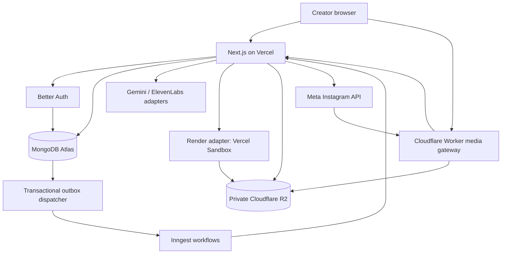
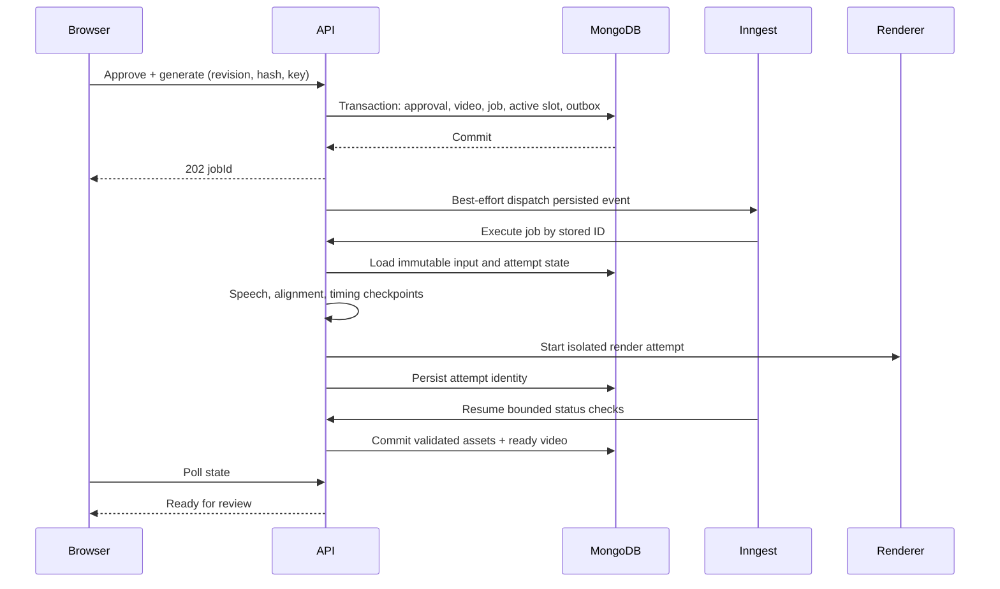

# NamasteVideo.ai — Application System Design

Version 1.0 · September 26, 2026  
Status: Implementation design; dashboard and hosted services are not yet implemented.  
Baseline: [PRD v2](PRD.md), [prototype status](PROTOTYPE_STATUS.md), and subsequent user decisions.  
Audience: Engineers implementing the internal V1.

Detailed contracts: [API design](API_DESIGN.md) and [database design](DB_DESIGN.md). These refine the outline below with exact response envelopes, additional history/session/candidate routes, immutable publishing payload revisions, stage lease records, and concrete index predicates. Where an outline differs from those details, use the detailed contracts. UI design and review in Google Stitch precede frontend implementation.

## 1. Scope and decisions

Build one Next.js application with server-side domain modules, a MongoDB database, private R2 assets, durable Inngest workflows, and isolated Remotion rendering. Keep the creator experience to **Idea → Storyboard → Video → Publish**. The system must outlive browser sessions, isolate each person's content, and publish only an explicitly approved video to that person's approved destination.

This document specifies the application target. Existing local code is a reusable foundation, not evidence that authentication, hosted rendering, or Instagram already works. No deployment, account provisioning, or publishing is performed by creating this document.

### 1.1 Reconciled requirements

| Area | Decision |
|---|---|
| Release | Founder and allowlisted internal users; individual accounts and private personal workspaces |
| Product | English educational motion-graphics explainers, 60–90 seconds, vertical 1080 × 1920 at 30 fps |
| Experience | Combined narration/storyboard review; conversational revisions; captions; preview/export; personal Instagram publishing and scheduling |
| Voice | Start dashboard testing with the explicitly accepted Daniel test voice, accurately labeled. Retain Indian male/female preset configuration but expose only API-accessible, auditioned presets. Do not substitute voices silently. |
| Model | Server-configured Gemini adapter; prototype default 3.5 Flash, successful binary-search override 3.8 Flash. Record exact configuration per operation; deployment must verify access rather than assuming the PRD's original 3.8 baseline. |
| Visuals | Preserve approved cream/teal visual system, DM Sans, vector diagrams, motion, and caption styling |
| Infrastructure | Next.js/Node.js, Better Auth, MongoDB Atlas, R2, Vercel, Inngest; Vercel Sandbox rendering candidate subject to benchmark |
| Omitted | Billing, credits UI, brand kits, shared workspaces, public signup, backups/restore, bulk unattended generation, other social platforms |

The user has now accepted the video quality, including the latest binary-search output, and requested application design. Indian voice evaluation remains deliberately deferred. Captions editing, generalized scene events, hosted recovery, and broader visual coverage remain engineering work. This design does not reinterpret acceptance of the examples as proof that arbitrary subjects are supported.

### 1.2 Architectural invariants

1. An authenticated server session determines ownership; client owner IDs never authorize access.
2. An approved storyboard and a generated video specification are immutable snapshots.
3. Running jobs read pinned inputs, never the project's mutable latest draft.
4. One planning/revision/generation pipeline may be active per project. Draft editing remains available. Brainstorm and post-caption jobs share this operation slot in V1 to keep conversational ordering explicit.
5. The last successful video remains accessible when a new job fails.
6. R2 is private; object paths alone grant no access.
7. Publication pins the asset hash, video approval, Instagram account, and caption.
8. Unknown external publication outcomes block a new publish attempt until reconciled.
9. No AI output becomes executable JavaScript, HTML, SQL, shell commands, or arbitrary asset URLs.
10. Regeneration produces a new version; it cannot silently replace a scheduled asset.

## 2. System topology



Arrows show logical calls, not database-trigger infrastructure. The outbox dispatcher is an application workflow reading MongoDB. Inngest coordinates steps executed by application handlers; it is not the render compute host.

Use a modular monolith: domain code lives in one repository and deployable web application; only rendering and media delivery have separate runtime boundaries. No separate Express service, Redis queue, Kubernetes cluster, or general microservice platform is necessary for internal V1.

### 2.1 Component responsibilities

| Component | Responsibilities | Must not do |
|---|---|---|
| Next.js App Router | Server-render initial private pages; client editors/player; Node route handlers | Render MP4s inside user HTTP requests |
| Domain services | Validate commands, enforce ownership, manage versions/approvals, perform atomic state changes | Trust AI/client-provided ownership or publishing approval |
| Better Auth | Password hashing, sessions, secure cookies, login/logout | Expose public signup or bypass internal allowlist |
| MongoDB | Durable source of truth for projects, operations, approvals, scheduling and connections | Store video/audio binaries |
| Inngest | Stage execution, waits, bounded retries, periodic reconciliation | Be the only record of business state |
| Render adapter | Launch, inspect, stop a pinned render attempt | Receive database, AI, or Instagram master credentials |
| R2 | Private immutable binary artifacts | Serve a public bucket of user media |
| Media gateway | Stream authorized ranges, revoke delivery grants, serve previews/downloads and Meta ingestion | Cache authorization decisions or expose bucket credentials |
| Provider adapters | Typed Gemini, ElevenLabs and Meta operations | Make unrecorded provider substitutions |

### 2.2 Packages and runtimes

Retain the current TypeScript, Zod and Remotion code. Pin all Remotion packages to the same version; prototype uses 4.0.529. Preserve its React compatibility when selecting the Next.js version. Add Next.js App Router, Better Auth, MongoDB native driver, Inngest, the AWS S3 SDK/presigner for R2, and the Vercel Sandbox SDK. Use CSS with shared tokens; a styling library is optional, not an architectural dependency. Use an IANA-aware timezone library or Temporal polyfill with explicit DST disambiguation.

Choose and lock a supported Node LTS and exact compatible package versions during scaffolding. Maintain a tested render runtime independently of Vercel's default web runtime. Keep provider/database code marked server-only. Use the Node runtime for database, auth, OAuth, and workflow routes. The media gateway uses the Cloudflare Worker runtime and an R2 binding.

## 3. Dashboard and browser architecture

### 3.1 Routes and screen behavior

| Route | Screen and behavior |
|---|---|
| `/sign-in` | Internal email/password login, generic errors, operator-assisted recovery instructions |
| `/dashboard` | Owner-only project cards; All/Drafts/Ready/Scheduled/Published/Needs attention filters; cursor pagination |
| `/projects/new` | Create an empty project and navigate to Idea |
| `/projects/[id]/idea` | Topic, optional audience and notes, optional brainstorming, available voice preview |
| `/projects/[id]/storyboard` | Scene cards with narration, schematic preview, estimated duration, inline editing and revision chat |
| `/projects/[id]/video` | Persistent job stages or final HTML video player, captions editing, scene/global revisions |
| `/projects/[id]/publish` | Exact selected video, destination identity, post caption, Post now / Schedule / Download |
| `/settings` | Personal timezone, future-project voice default, Instagram connection, sign-out |

The four routes share one project layout and four-step indicator. Errors and disabled actions explain prerequisites without adding screens. Download is available from the video and publishing screens and never requires Instagram.

Use an HTML `<video>` player for the actual encoded output, with pause, seek and volume. Storyboard cards use the same trusted component registry with synthetic representative timing, explicitly labeled schematic/estimated. They do not imply an already generated voiceover. Ready-video thumbnails come from the real timeline. Do not expose synthetic preview timing as narration alignment.

### 3.2 Browser/server state

Server state: persisted draft, immutable versions, operations, approved output, schedules. Browser state: editor text, unsaved edits, selection, player position. Keep job IDs in the URL/project response so refresh resumes observation instead of repeating submission.

Poll active jobs every 2 seconds while visible, backing off to 10 seconds while hidden; stop for terminal states. Polling retrieves stage and completed scene counts. Only show percentages for measured rendering progress. SSE/WebSockets are unnecessary for V1. Initial page loads and refetch after focus restore authoritative server state.

Private responses use `Cache-Control: private, no-store`. Any client query cache key includes the authenticated user ID. Clear caches and local recovery drafts on sign-out. Avoid a service worker caching private media or API responses.

### 3.3 Autosave and conflicts

- Debounce text saves by 1 second; every draft has integer `revision`.
- `PATCH draft` includes `expectedRevision`; update uses compare-and-swap and increments revision.
- On 409, preserve local text and show reload/compare/reapply options. Do not silently apply last-write-wins.
- Flush and await saves before approval, generation, navigation between steps, and schedule confirmation.
- If a save fails, actions requiring saved input remain disabled; distinguish Saving, Saved, Unsaved and Save failed.
- Optional local recovery uses user/project-scoped session storage with a timestamp; never store tokens or imply server persistence. Restore only after confirming the same signed-in user.
- AI requests snapshot the current revision. If the user edits while AI runs, save the result as a candidate against its source revision and show a conflict instead of replacing new edits.

## 4. Authentication and ownership

Use Better Auth email/password sessions and its MongoDB adapter. Supply the MongoDB client so the adapter can use transactions where supported. Better Auth documents this adapter configuration; use its supported password/session APIs rather than custom cryptography. [Better Auth MongoDB adapter](https://better-auth.com/docs/adapters/mongo)

Provision accounts with an operator CLI through the supported auth API. Disable public signup both in the UI and server configuration/hooks. Maintain `internalAccess` records keyed by normalized email, with enabled/disabled status. Admission requires both an existing account and an enabled allowlist entry; creating an allowlist entry alone does not create a user. Provisioning verifies control of the email out of band for this internal release. Operator-assisted password reset uses a one-use reset flow and revokes sessions; never log temporary passwords. Recheck access status on application commands and worker startup.

Cookies are Secure, HttpOnly and appropriate SameSite, with explicit trusted origins. Validate Origin on cookie-authenticated mutations and use Better Auth's built-in protections for its routes. Session expiry leads to sign-in with a validated relative return path. Jobs already accepted continue unless the account has been disabled; disabling access cancels queued generation and pauses pending publishing while allowing reconciliation of submitted external actions.

One workspace per user is represented by `workspaceId = user.id`; no separate workspace membership system. Every domain record includes `ownerId`. Repository methods require an authenticated owner context, for example `findProject({ownerId, projectId, deletedAt:null})`. Nested reads verify parent ownership too. Return 404 for inaccessible IDs to avoid revealing another user's records.

Background events carry only job/intent IDs. Workers load records and derive ownership from persisted state. Event owner values are ignored for authorization. Inngest routes verify service signatures. Media gateway calls use separate service authentication plus a narrowly scoped media grant; they cannot submit general user commands.

## 5. Data model and indexes

Use MongoDB native driver with Zod validation at service boundaries. Use transactions for multi-record invariants, primary reads for claims, and majority writes for accepted commands. MongoDB supports multi-document transactions; do not parallelize operations inside a transaction or make external API calls in its callback. [MongoDB transaction documentation](https://www.mongodb.com/docs/drivers/node/current/crud/transactions/)

Use opaque application IDs consistently; normalize Better Auth IDs at the boundary. All timestamps are UTC BSON dates. Every record has `createdAt`, `updatedAt`, and schema version where applicable. Large narration alignments and timelines are JSON assets in R2. Never embed unbounded chat arrays or histories in a project document.

### 5.1 Collections

| Collection | Essential fields |
|---|---|
| Auth-managed collections | User, session, account and verification records under Better Auth's supported schema |
| `internalAccess` | normalizedEmail, enabled, provisionedUserId |
| `preferences` | ownerId, timezone, defaultVoicePreset |
| `projects` | ownerId, title, draftRevision, activeJobId, currentStoryboardId, latestReadyVideoId, selectedVideoId, deletedAt |
| `drafts` | ownerId, projectId, revision, topic, audience, notes, editablePlan, voicePreset, sourceVersionId |
| `messages` | ownerId, projectId, conversationId, operationId, role, text, sourceVersionId, sequence |
| `storyboards` | ownerId, projectId, parentId, planSchemaVersion, content, contentHash, sourceDraftRevision, plannerConfig, reviewState |
| `approvals` | ownerId, projectId, kind, subjectId, subjectHash, approvedBy, approvedAt, inheritedFromApprovalId if applicable |
| `videos` | ownerId, projectId, storyboardId, storyApprovalId, renderSpec, renderSpecHash, parentVideoId, state, timelineAssetId, outputAssetId, outputHash, qa, resolvedVoice, rendererBuildId |
| `jobs` | ownerId, projectId, type, inputSnapshotRef, state, stage, activeSlot, attempt, cancellationRequestedAt, progress, sanitizedError, deadlineAt |
| `stageAttempts` | ownerId, jobId, stageKey, attemptId, fingerprint, state, leaseOwner, leaseUntil, fencingToken, providerRequestId, artifactIds, startedAt, finishedAt |
| `assets` | ownerId, projectId, videoId/jobId, kind, objectKey, sha256, bytes, contentType, state, producerFingerprint, metadata |
| `renderAttempts` | ownerId, jobId, videoId, attemptId, sandboxId, commandId, fencingToken, rendererBuildId, state, deadlineAt, resultManifestKey |
| `commands` | ownerId, scope, idempotencyKey, requestHash, resourceId, storedResponse |
| `outbox` | eventId, aggregateId, eventType, payloadIds, state, attempts, availableAt, leaseUntil |
| `instagramConnections` | ownerId, instagramUserId, username, accountType, scopes, encryptedToken, tokenKeyVersion, expiresAt, tokenRevision, destinationEpoch, state |
| `oauthStates` | stateHash, ownerId, initiatingSessionHash, returnProjectId, expiresAt, consumedAt |
| `publishIntents` | ownerId, projectId, videoId, videoApprovalId, assetId/hash, connectionId, instagramUserId, destinationEpoch, caption, payloadHash, state, scheduledAtUtc, timezone, localTime, chosenOffset, revision, claimToken |
| `publishAttempts` | ownerId, intentId, attemptId, phase, containerId, submissionState, requestStartedAt, providerMediaId, permalink, sanitizedError, nextCheckAt |
| `mediaGrants` | tokenHash, ownerId, projectId, assetId, purpose, intentId/jobId, expiresAt, revokedAt |
| `diagnosticEvents` | correlationId, ownerId, projectId, operationId, eventType, stage, durationMs, safeErrorCode |

An immutable record's content never changes; lifecycle metadata may advance atomically. Approved storyboards do not have their content overwritten when superseded. `selectedVideoId` is a UI selection, not a schedule pointer. A publish intent holds its own frozen reference.

### 5.2 Required indexes

| Collection | Index / invariant |
|---|---|
| internalAccess | unique normalizedEmail |
| preferences | unique ownerId |
| projects | `(ownerId, deletedAt, updatedAt desc, _id desc)` for stable cursor listing |
| drafts | unique `(ownerId, projectId)` |
| messages | `(ownerId, projectId, conversationId, sequence)` unique |
| storyboards/videos | `(ownerId, projectId, createdAt desc, _id desc)` |
| approvals | unique `(ownerId, kind, subjectId, subjectHash)` |
| jobs | unique `(ownerId, projectId, activeSlot)` with partial filter `activeSlot:true`; terminal jobs unset it |
| jobs | `(state, deadlineAt)` for recovery |
| stageAttempts | unique `(jobId, stageKey, attemptId)`; `(state, leaseUntil)` |
| assets | unique objectKey; `(ownerId, projectId, kind, producerFingerprint)` for reuse lookup |
| commands | unique `(ownerId, scope, idempotencyKey)` |
| outbox | unique eventId; `(state, availableAt, leaseUntil)` |
| instagramConnections | unique ownerId and unique instagramUserId; unset account ID on fully disconnected records after reconciliation |
| oauthStates | unique stateHash; TTL expiresAt |
| publishIntents | `(state, scheduledAtUtc)` and `(ownerId, projectId, createdAt desc)` |
| publishAttempts | unique `(intentId, attemptId)`; `(submissionState, nextCheckAt)` |
| renderAttempts | unique `(jobId, attemptId)` |
| mediaGrants | unique tokenHash; TTL expiresAt |

TTL deletion is housekeeping, not authorization: always evaluate expiry in code. Use no TTL on projects, videos, approvals, or unresolved publication attempts. Validate all referenced IDs belong to the same owner/project in the service; MongoDB does not supply these foreign-key constraints.

## 6. Versioned content contracts

Introduce application schema v2 alongside the local v1 parser. A migration imports v1 only through a tested adapter and records provenance; never label imported synthetic fixtures as live outputs. Existing local demo videos are not automatically assigned to every user. Optional import requires an explicit owner and marks output ready for review, without implying publication approval.

A storyboard contains title, audience, learning objective, source-note references, voice preset and ordered scenes. Each scene has stable IDs, original narration, pronunciation preferences, visual component name/version, bounded component data, source references, and an array of semantic events. Events identify a permitted visual target/action and a narration phrase/occurrence with a bounded intentional offset. Separate literal data from illustrative examples. No external URLs or generated code in scene data.

Keep renderer components behind a registry: `schema`, `validateSemantics`, `estimateLayout`, `render`, and supported actions. Replace prototype topic-name regex routing with an explicit validated capability selection. Model output can select only supplied component IDs. Add title/takeaway wrappers, labeled diagrams, timeline and chart components alongside existing process, comparison, flow, and binary-search components. Unavailable visuals produce a reviewable simpler schematic or a needs-input response, never unrelated imagery.

### 6.1 Hashes and approval

Use canonical JSON serialization and SHA-256 for hashes. Exclude timestamps and mutable status fields. Store both schema version and canonicalization version. The local prototype hashes JSON serialization; application migration must make key-order behavior explicit.

`storyHash` covers ordered narration, pronunciation input, factual/semantic visual data, source references and voice choice. `renderSpecHash` additionally covers layout, caption display overrides, visual component versions, font/assets and renderer/compiler build. The video approval covers the encoded asset hash plus render specification.

Approve & generate atomically freezes the saved draft into a storyboard, records story approval, resolves the selected voice/model configuration, creates a video/job, claims the project active slot, and inserts an outbox event. Reject a mismatched draft revision or unavailable voice before acceptance.

### 6.2 Revision rules

| Requested change | Approval and invalidation |
|---|---|
| Narration/facts/pronunciation | New storyboard candidate and story approval; regenerate affected speech and all dependent timing/render |
| Voice | Explicit voice change command creates a new approved configuration snapshot; regenerate all speech; final video review required |
| Layout/label size | Trusted visual fields only; inherit story approval if semantic hash unchanged; reuse speech; new render and final approval |
| Caption display spelling | Persist separate word-span display override; reuse speech if spoken meaning unchanged; rerender and final approval |
| Scene ordering | New story approval; reuse compatible individual audio; rebuild global timing/render |
| Restore earlier version | Create/select a draft derived from the old snapshot; never mutate history or scheduled payload |
| Instagram caption/time | Update unclaimed publish intent under revision check; no video generation |

AI classifies revisions, but server structural diffs enforce the result. Requests labeled “visual” that change narration, chart values, arrows' semantic relationships, or meaning return to storyboard review. Caption correction cannot silently change facts. Uncertain semantic changes require narration revision rather than treating an AI classifier as an authorization boundary.

### 6.3 Timing, pronunciation and captions

Retain original text, provider speech text, and an explicit span mapping. Initially support reviewed deterministic pronunciation substitutions (for example SQL → sequel) that resolve before synthesis. Bind caption overrides to stable source spans and speech fingerprints, not raw global frame numbers. If narration changes, invalidate affected overrides or ask the user to reapply them; unrelated visual edits retain them.

Use returned alignment only after validating character arrays, monotonic starts, duration bounds and complete text mapping. Keep strict failure behavior until normalization mapping has dedicated tests. No invented timestamps or automatic untested aligner fallback. Convert speech times to frames, build contiguous scenes, then captions and visual events. No silent speed-up to force duration; substantive changes return for story approval.

Add actual font measurement and layout checks in the render environment: two caption lines maximum, bounds inside reserved safe zones, no label/diagram collisions, no hidden overflow. Long text produces needs-input or a reviewable shorter candidate. Sample important cue boundaries and final scene endings. Target the PRD's approximately 200 ms cue accuracy in measured evaluation, with semantic lead offsets recorded explicitly.

## 7. API contracts

All `/api` user routes require session and enabled access except auth callbacks. Validate path/query/body with Zod, reject unknown mutation fields, cap topic/context at 2,000 characters and notes at 20,000, paginate lists at 20 (maximum 50). Use one shared service layer for routes and workflows.

Mutations that start work require `Idempotency-Key`; key scope includes owner and command type. Repeated key/same payload returns the saved resource/result. Same key/different payload returns 409. Use `expectedRevision` for mutable drafts and schedules. Initial async responses are `202 {jobId, resourceId, state}`. Errors return `{code, message, correlationId, retryable, fieldErrors?}` with safe messages.

| Method and route | Input / result |
|---|---|
| GET/POST `/api/projects` | Cursor/filter list; create project + empty draft |
| GET/PATCH/DELETE `/api/projects/:id` | Owner view; rename with revision; tombstone and enqueue cleanup |
| GET/PATCH `/api/projects/:id/draft` | Current draft; CAS autosave |
| GET `/api/projects/:id/messages` | Paginated conversation |
| POST `/api/projects/:id/brainstorm` | Saved source revision + prompt → durable planning job |
| POST `/api/projects/:id/storyboards` | Saved draft revision → storyboard planning job |
| POST `/api/projects/:id/revisions` | Source storyboard/video ID, scene ID optional, instruction → candidate or visual job |
| POST `/api/projects/:id/generations` | Draft/storyboard hash + expected revision + approve=true → atomic approval/job |
| GET `/api/jobs/:id` | Owner-only state, stage, real progress, error and result references |
| POST `/api/jobs/:id/cancel` | Persist cancellation request; does not claim to undo submitted external work |
| POST `/api/jobs/:id/retry` | Safe failed stage only, new execution attempt; immutable inputs |
| GET `/api/videos/:id` | QA, duration, provenance, captions, revision lineage |
| POST `/api/videos/:id/approve` | Exact outputHash/renderSpecHash → final approval |
| PATCH `/api/videos/:id/captions` | Source hash + span display overrides → new render specification/job |
| POST `/api/assets/:id/access` | Preview/download purpose → short-lived gateway URL |
| GET `/api/voices` | Only configured available presets, accurate accent labels and authorized sample URLs |
| GET/PATCH `/api/preferences` | Personal timezone/default voice |
| POST `/api/instagram/connect` | Session-bound OAuth state and allowlisted authorization redirect |
| GET `/api/instagram/callback` | Validate state/session, exchange code, verify account, save connection |
| GET/DELETE `/api/instagram/connection` | Identity/health; disconnect and pause pending delivery |
| POST `/api/projects/:id/post-caption` | Approved content → persisted caption suggestion job |
| POST `/api/publish-intents` | Approved video, displayed destination snapshot, caption, optional schedule → immutable delivery payload |
| GET/PATCH `/api/publish-intents/:id` | Status; CAS reschedule/caption/replacement before claim |
| POST `/api/publish-intents/:id/cancel` | Atomic pending-state cancellation |
| POST `/api/publish-intents/:id/retry` | Only definitively safe failure; never an unknown submitted outcome |
| `/api/inngest` | Signed workflow delivery; no public job execution |
| POST `/api/internal/media-authorize` | Gateway-authenticated grant check; returns only authorized object metadata |

Use 401 for absent/expired sessions, 404 for non-owned resources, 409 for stale/conflicting/active operations, 422 for invalid content or prerequisites, 429 for operational rate limits, and 503 for temporary infrastructure failure. Never return provider keys, tokens, raw stack traces or sensitive prompts.

## 8. Durable job execution

### 8.1 Accepting a generation



A once-per-minute outbox workflow dispatches committed, unsent events. Immediate dispatch is only a latency optimization. Claim outbox records with a lease, send a stable event ID, then mark sent. A crash between send and mark can redeliver; workers deduplicate using MongoDB state even if event-service deduplication expires. Also recover accepted jobs with no observed execution. Never rely on an unawaited promise after a Vercel response.

Inngest checkpoints completed steps and supports durable sleeps. Its concurrency limit applies to executing steps, so it does not enforce our “one active pipeline per project” rule; MongoDB's active slot does that. Keep large audio/timeline payloads in R2 and return references from steps. [Inngest steps](https://www.inngest.com/docs/learn/inngest-steps), [concurrency](https://www.inngest.com/docs/guides/concurrency)

### 8.2 Stages

| Stage | Durable result | Recovery |
|---|---|---|
| Validate input | Pinned hashes, capabilities and configuration | Fail invalid/unapproved input before provider calls |
| Plan/revise, when applicable | Validated candidate/storyboard and review summary | Bounded transient retry; at most one schema repair; no silent approval |
| Speech per scene | MP3, alignment, fingerprint, provider attempt | Reuse verified compatible artifacts; handle ambiguous call separately |
| Compile | Timeline, caption map, measured duration | Deterministic rerun from saved artifacts |
| Prepare/render | Render attempt, progress, temporary result manifest | Reattach known attempt or start a fenced new attempt |
| Validate/store | Media probe, layout/cue checks, checksums, R2 assets | Retry upload/validation; never expose partial output as Ready |
| Complete | Ready-for-review video and latestReadyVideoId | Atomic terminal transition and release active slot |

### 8.3 Leases and side effects

Every externally active stage has an attempt ID and lease. Initial lease is 90 seconds, renewed every 30 seconds for active work; each takeover increments a fencing token. Completion writes require the current token. A lease expiry alone does not prove a remote request failed. Recovery inspects its attempt state before repeating it.

Before a speech call, persist `request_started`. After success, upload to an attempt-specific R2 key and record the artifact/hash, then checkpoint. If a worker disappears after the provider accepted the call but before durable storage, mark `provider_outcome_unknown`. Reuse any verified uploaded artifact found by deterministic attempt key. Otherwise require an explicit Retry audio action with possible repeat provider use; do not let Inngest automatically repeat an ambiguous charged request. Publication uses the stricter reconciliation rules in section 12.

Set explicit SDK retry policies so framework retries cannot bypass this state machine. Retry only known-safe operations. A new attempt does not rewrite the old one.

### 8.4 Initial operational settings

These are adjustable application defaults, not provider quotas or measured performance promises. Database render slots enforce the lifetime of active sandboxes; Inngest step concurrency alone cannot enforce that limit while polling functions sleep.

| Setting | Initial value |
|---|---|
| Active pipeline | 1 per project; 2 executing generation stages per owner |
| Speech | Sequential within a video; global speech concurrency 2 |
| Active render sandboxes | 2 globally, 1 per owner, enforced by a leased DB render-slot claim |
| Planner/speech request timeout | 120 seconds, below configured function limit; otherwise move provider call into worker runtime |
| Safe transient retries | At most 2 retries with jitter; honor Retry-After, stop on auth/validation/policy errors |
| Render deadline | 15 minutes provisional; terminate/mark failed at deadline |
| Pipeline deadline | 30 minutes excluding explicit user input |
| Outbox/schedule/recovery scan | Every minute; bounded batches with indexed queries |
| Failed retry UX | Retry safe stage or regenerate a new version, with previous output preserved |

Cancellation sets `cancel_requested`. Before each stage and before committing output, check it and project deletion. Stop render compute where possible; an already-running provider request may finish and save a cancelled-job artifact, but must not advance the active video to Ready. Terminal transitions clear the active slot conditionally so an old worker cannot release a newer job's lock.

## 9. Hosted render lifecycle

Implement `RenderAdapter.start(input)`, `status(attempt)`, `cancel(attempt)` and `collect(attempt)`. Keep `LocalRenderAdapter` for development and implement `VercelSandboxRenderAdapter` behind the same interface.

The ordinary Vercel app must not host a full Remotion render inside an API request. Remotion's Vercel documentation distinguishes web hosting from render compute; the selected Sandbox path is a separate integration that still needs our R2 adapter and benchmarking. [Remotion on Vercel](https://www.remotion.dev/docs/vercel)

1. Create a DB attempt and reserve a render slot before starting compute.
2. Start a sandbox tagged with attempt ID, using a trusted pinned build containing Node, Chromium, Remotion, FFmpeg tooling, components and local fonts.
3. Persist sandbox identity immediately, then launch a detached render command. Use a known result/status path keyed by attempt ID so a lost command response can be inspected safely.
4. Provide validated timeline JSON, exact asset download grants and exact output upload grants. Supply no MongoDB, Gemini, ElevenLabs, Meta or broad R2 secrets.
5. Download required inputs before rendering; verify hashes. Restrict egress to required storage/control destinations, and block arbitrary user URLs. Use Vercel Sandbox network policy where available. [Vercel Sandbox](https://vercel.com/docs/sandbox)
6. Remotion renders to an attempt-local MP4. The worker reports progress and produces media/layout QA plus a checksum manifest. The output uploads to an attempt-specific private R2 key before sandbox teardown.
7. Inngest uses short status steps and durable sleeps, never a request held open for the render duration. A supervisor validates uploaded artifacts and conditionally commits video readiness under the current fencing token.
8. Stop the sandbox and release the render slot in completion/failure cleanup. A periodic sweeper handles abandoned attempts and overdue compute.

If sandbox creation succeeds but its response is lost, reconcile by attempt tag using the provider API. If that capability is unavailable in the pinned SDK, wait for the old creation deadline and bounded sandbox expiry before replacement; retain attempt-specific output keys and fencing so late output cannot win. Do not claim infrastructure creation is exactly once.

Use a small signed completion manifest even if progress callbacks fail. Callback endpoints, if introduced, need attempt-scoped credentials and fencing validation; callback data alone cannot authorize a result. Renderer builds are immutable and referenced by job, so deployment changes do not alter in-flight output.

### 9.1 Hosted benchmark gate

Run the three existing examples on the actual hosted environment, then test two simultaneous renders. Record cold start, preparation, render, upload, peak memory, output size and failure rate. Exercise interruption and loss of the polling request. Verify Linux fonts, browser dependencies, R2 upload/download, AAC/H.264 playback and visual parity with local output.

The five-minute preview target remains provisional. If Sandbox limits or measured behavior fail the gate, replace only the adapter with a dedicated container renderer or Remotion Lambda after documenting the infrastructure decision. Do not describe the local laptop as a production fallback.

## 10. Private media and storage

Use separate R2 buckets for development, staging and internal production. Keys follow `owners/{ownerId}/projects/{projectId}/videos/{videoId}/attempts/{attemptId}/{assetId}.{ext}`. Keys are generated by application code; reject path traversal and arbitrary object references.

Assets progress `staging → ready → deleting → deleted`. Upload immutable objects, verify size/type/hash, then commit the DB reference. A upload-success/DB-failure orphan is recovered by attempt key or removed by cleanup. R2 ETag is not assumed to be a SHA-256 content hash. Store computed SHA-256 explicitly.

### 10.1 Delivery grants

Use a lightweight Cloudflare Worker with an R2 binding to stream media. This addition prevents large video streaming through short-lived Next.js handlers and allows revocable access when a project is deleted. Ordinary direct R2 presigned URLs cannot enforce an application tombstone after issuance; reserve them for isolated render input/output transfers. R2 provides S3-compatible presigning; treat signed URLs as secrets and configure exact CORS rules when browser access is used. [R2 presigned URLs](https://developers.cloudflare.com/r2/api/s3/presigned-urls/)

- Owner requests preview/download access from Next.js; the server checks ownership and creates a random 256-bit grant, storing only its hash.
- The returned gateway URL is a bearer capability for one asset and purpose. Default preview/download lifetime: 10 minutes. Browser refreshes on expiry while preserving seek position.
- Each GET/HEAD/Range request goes through gateway service authentication to the internal authorization route. That route checks token expiry/revocation, project tombstone, ownership relation, asset readiness, and intent state where relevant.
- Worker returns proper Content-Type, Content-Length, Accept-Ranges, 206/416 behavior and download disposition. No public CDN cache, authorization cache, or redirects to permanent storage URLs. Use no-store and redact grant URLs from logs.
- Deletion/revocation blocks subsequent requests immediately; bytes already downloaded or an in-flight stream cannot be recalled. This is the explicit access boundary.
- Meta ingestion receives a dedicated grant created near execution time, initially valid for up to 24 hours subject to live ingestion tests. It is scoped to the frozen intent and asset and does not require a creator session. Revoke after ingestion/publication is resolved or the attempt is safely cancelled.

CORS is not authorization. Browser origins are allowlisted; Meta server fetches use capability authorization. Range support and HTTPS fetchability are integration gates before enabling publishing. No user content is placed in the deployed application's `public/` folder.

### 10.2 Reuse and deletion

Cache reuse is limited to the same owner and project in V1. Fingerprint speech from provider/model/resolved voice/settings/provider text/normalization version; verify hash before reuse. A voice switch regenerates all speech. Do not use cross-user content-addressed caches.

Project deletion transaction tombstones the project, revokes media grants, cancels unclaimed intents and requests job cancellation. Cleanup waits for active writers and reconciles already-submitted publication; late writes check the tombstone and cannot resurrect the project. Remove owned R2 objects and active-store content idempotently, retaining only minimal unresolved operation identifiers until reconciliation completes. Inform the user that already-published Instagram posts are not deleted. No recycle bin, backup system, or indefinite content retention service is introduced.

## 11. State machines and UI projection

Keep editing, generation and publishing independent. A project can have a draft, a running revision, and an older scheduled output simultaneously.

| Entity | States and key transitions |
|---|---|
| Planning job | queued → running → succeeded / needs_input / failed / cancelled |
| Storyboard | review_ready → approved; later versions supersede selection, not historical content |
| Generation job | queued → running → succeeded / needs_input / failed; running → cancel_requested → cancelled |
| Video | building → validating → ready_for_review → approved; building/validating → failed |
| Connection | connected / expiring / reconnect_required / disconnected |
| Publish intent | scheduled or queued → claimed → preparing → processing → submitting → published; alternatives paused_auth, failed_safe, outcome_unknown, needs_attention, cancelled |

`outcome_unknown` transitions to published or a confirmed safe failure only through reconciliation. `published` is terminal even if the external post later disappears. Failed generation is distinct from a video waiting for user approval. Dashboard badges are a deterministic projection of these records, not a mutable all-purpose `project.status`.

## 12. Instagram connection, publication and scheduling

### 12.1 Authorization

Use Instagram Login for professional Creator/Business accounts. Meta's official collection identifies this flow as independent of Facebook Page linking and documents `instagram_business_basic` and `instagram_business_content_publish`. Request only the access needed for this product. Pin an API version after live setup; do not mix Facebook Login's Page-token examples with Instagram Login requests. [Meta Instagram Login documentation](https://www.postman.com/meta/instagram/folder/6raa77c/instagram-api-with-instagram-login)

Connect creates random one-use state, stores its hash with initiating user/session and a 10-minute expiry, and redirects to an allowlisted provider URL. Callback requires that session, valid unused state, matching redirect URI, and a server-side code exchange. Consume state atomically. After cancellation or failure, return to the preserved project. A lost session requires restarting authorization; no account is attached from an unbound callback.

Fetch the provider account identity and scopes. Enforce unique instagramUserId and ownerId without disclosing other owners on conflict. Encrypt tokens with authenticated encryption (AES-256-GCM), unique nonce, key version and associated data containing owner/connection IDs. Keep encryption keys separately in server secret configuration. Token values never reach the client.

Record provider expiry and refresh according to the selected API's documented rules, under a token-revision compare-and-swap lock. Do not hardcode assumed lifetimes. Failed refresh or revoked access pauses pending delivery. Reconnecting the same account updates credentials; reconnecting another increments `destinationEpoch` and requires explicit approval of every pending destination change.

Disconnect pauses unclaimed intents, revokes media grants where safe, and prevents new submissions. Preserve only narrowly scoped encrypted credentials needed to reconcile an already-submitted request until resolution or expiry; then erase them. No further publishing is allowed through that retained reconciliation state.

App credentials and test-account roles are infrastructure setup. Internal usage does not guarantee that Meta review or additional access is unnecessary. Publishing remains feature-gated until the real configured flow and authorized account pass tests.

### 12.2 Frozen publishing intent

Post now or Confirm schedule supplies final video approval, displayed account identity, exact caption and optional time. Server checks all belong to the user, the asset is ready, and the destination epoch still matches. Store this snapshot and its hash before any Meta call. Clicking these controls authorizes that payload once; background generation never implies publication authorization.

Only one unresolved intent for the same video/account/payload is accepted; a matching request returns it. Enforce this with a unique partial index on `(ownerId, videoId, instagramUserId, payloadHash)` where `unresolved:true`; clear the field only on a definitively terminal state. Unknown outcomes retain it. Intentional reposting after a completed post requires an explicit new confirmation, not an automatic retry. All retry actions reference the original intent.

### 12.3 Delivery algorithm

1. Atomically claim an eligible due/queued intent with revision and state checks. Cancellation/rescheduling uses the same predicate, so only one side wins.
2. Recheck project state, final approval/hash, account identity/epoch, token health, media accessibility and current API constraints/quota.
3. Create a Meta media container using the dedicated ingestion URL and approved caption. Persist the container ID before later steps.
4. Poll processing status in bounded workflow steps. Only attempt publication when the provider reports the container ready.
5. Persist `submission_started` and attempt identity before calling media_publish. This state is a durable barrier against blindly repeating the call.
6. On confirmed success, store provider media ID, confirmed time and permalink when available. Commit Published; disable duplicate retries.
7. On a definite pre-submission/validation failure, expose safe retry or correction. On a timeout, worker crash, or uncertain response after submission, set Outcome unknown and reconcile.

Meta's official collection describes the container-processing-before-publication sequence. Its documentation includes both login families; implementation must verify the exact Instagram Login endpoints, status fields and constraints against the pinned version. [Meta publishing collection](https://www.postman.com/meta/instagram/documentation/6yqw8pt/instagram-api)

Do not claim exactly-once external delivery. Internal idempotency prevents deliberate duplicate submission, but the database and Meta cannot share a transaction. After ambiguous submission, query the saved container/status and documented result endpoints. Confirm published state from authoritative evidence; a matching caption/time in a media list alone is insufficient proof. If a published container is confirmed but the permalink cannot be recovered, show Published with link unavailable. If evidence remains inconclusive, retain Needs attention/Outcome unknown and block automatic reposting. An operator can record verified external evidence through a restricted diagnostic command with an audit event.

Creating a container and publishing it are separate side effects. A lost container-creation response may leave an unused container; no publication may occur without a persisted ID and explicit submission barrier. Provider limits, container lifetime, codec/size limits, polling cadence and caption length are configuration validated at setup rather than copied from old examples into permanent constants.

### 12.4 Schedule semantics

Store UTC execution time plus IANA timezone, entered local time and chosen UTC offset. Use preference → browser timezone → Asia/Kolkata fallback. Reject past times and enforce a five-minute lead time. Detect DST gaps and repeated times; ask for a valid time or explicit offset rather than silently shifting it.

Use a minute-based Inngest due-intent scanner as the authoritative V1 scheduler. Query indexed due intents and atomically claim them; no sleeping function per arbitrarily distant schedule is necessary. This avoids stale sleep instances after repeated reschedules. Expected start precision is within roughly one scan interval under healthy operation, not exact-second delivery. Platform processing adds visibility delay.

All caption/time/video replacements require expected intent revision and must occur before claim. Replacement revalidates final approval and freezes a new payload revision. Once claimed, show publishing has started; cancel becomes best effort and never claims to undo an external submission.

Use a 15-minute lateness/retry window from the intended start. Recheck time immediately before publication, not only before container creation. If no publish request was submitted and the window has expired, mark Needs attention and ask the user to choose a new time. If submission was already attempted, reconciliation continues beyond that window without a new publish call. Token/account/media failures pause delivery; reconnection does not automatically post an overdue schedule.

## 13. Failure handling and recovery matrix

| Failure/race | Required behavior |
|---|---|
| Double click or lost command response | Return same command/job/intent identity |
| Mongo commit succeeds; event send fails | Outbox redispatch; no lost accepted job |
| Duplicate worker delivery | DB claim and stage attempts prevent concurrent side effects |
| Two tabs save | 409 with preserved local edits |
| Draft changes during planning | Candidate retains source revision; explicit merge/apply |
| Edit during rendering | Separate draft; immutable running snapshot |
| Provider malformed JSON | Validate, bounded repair, then needs-input/failure |
| Provider auth/policy failure | No blind retry or provider substitution |
| Speech timeout with uncertain result | Recover artifact if available; otherwise explicit retry |
| Invalid alignment or out-of-range duration | Block Ready; return reviewable narration correction |
| Missing R2 asset | Fail integrity check; regenerate new version, pause dependent schedules |
| Sandbox crash | Reuse speech/timeline, retry fenced render attempt |
| Old worker completes after takeover | Reject stale fencing token; clean orphan assets |
| R2 upload succeeds; DB commit fails | Inspect attempt key and checksum; recover or cleanup |
| Session expires/browser closes | Jobs continue; user signs in and polls persisted state |
| Cancel races with output completion | Conditional state transition chooses winner; preserve earlier output |
| OAuth state replay/session mismatch | Reject attachment, restart connection |
| Another user owns Instagram destination | Generic connection conflict, no identity disclosure |
| Schedule cancel races with claim | Atomic state/revision check; report already-started state honestly |
| Different account reconnects | Pause old intents; no silent retargeting |
| Publish timeout after submission | Reconcile, block duplicate retry |
| Scheduler outage beyond window | Needs attention; no unexpected late post |
| Project deletion during publication | Remove access; reconcile submitted side effect; do not promise external cancellation |
| External post deleted by user | Retain history; never automatically recreate |

Recovery scanners act on indexed nonterminal records, with bounded batches and backoff. They do not simply rerun every failed function. Alert when outbox age, stale leases, sandbox deadlines, unknown outcomes or overdue schedules exceed their intended window.

## 14. Security, operational limits and accessibility

- Validate ownership on every read, mutation, job lookup, media grant and callback; test with two unrelated users and forged nested IDs.
- Use TLS, encrypted provider tokens, distinct environment secrets, least-privilege bucket credentials and scoped worker grants.
- Escape rendered text; never use AI output with `dangerouslySetInnerHTML`. Allow only trusted component/asset registries, preventing SSRF and arbitrary code execution.
- Use per-user/IP login throttling and database-backed atomic request counters for expensive commands. Start at 10 planning commands per user per minute, in addition to active job limits; tune after observation. These are operational protections, not billing credits.
- Keep notes, scripts, tokens, signed URLs and raw provider responses out of standard logs. Log IDs, stage, latency, safe error codes and model/build provenance.
- Restrict CSP to application/media/provider authorization origins; no arbitrary iframe embedding. Use a strict referrer policy for media grants.
- Ensure keyboard navigation, focus restoration after dialogs, labeled controls, contrast and mobile review/download. Announce stage changes politely, not every poll. Respect reduced motion in the dashboard without changing the approved encoded video.
- Store content until explicit deletion. No dedicated backups or restore guarantee. Loss of the only project database is outside V1 recovery; missing media can be regenerated only if its source survives.

## 15. Observability and performance

Use structured logs and existing MongoDB job records rather than a new analytics product. A correlation ID follows command → job → provider attempt → render → publish. Record queue delay, stage duration, cache hits, output duration/bytes, render peak resources when exposed, and failure category. Do not call these billing metrics.

Initial goals: ordinary CRUD p95 below 1 second and async command acknowledgment below 2 seconds under internal load, excluding OAuth/provider responses. Measure rather than promise generation latency. Preserve the PRD's 95% supported-set generation success and 80% usable-within-two-revisions as evaluation targets. Unintended duplicate posts and cross-user access are release blockers regardless of averages.

Capacity planning starts with a small internal cohort, not a predicted public scale. Three prototype outputs are roughly 77–82 seconds; measured binary-search MP4 is about 4.9 MB. Use actual per-run measurements for storage planning: `users × videos/user × retained versions × measured assets/version`. Do not assume the small sample's bitrate or latency holds for all future components. Model responses, speech latency and rendering are likely larger costs than CRUD. Review spending in provider consoles; no cost dashboard or credit ledger.

## 16. Deployment, configuration and repository plan

### 16.1 Repository boundaries

```text
app/                       # Next.js routes, layouts and route handlers
components/                # Dashboard UI, editors, player, status views
src/contracts/             # Versioned domain and API schemas
src/domain/                # Project, approval, job, revision and publishing services
src/db/                    # Mongo client, repositories, indexes, migrations
src/auth/                  # Better Auth setup and internal admission
src/providers/             # Existing AI adapters + Instagram adapter
src/workflows/             # Inngest functions, outbox and reconciliation
src/pipeline/              # Reusable timing, captions, validation, cache fingerprints
src/video/                 # Existing React/SVG components + registry
src/render/                # Local and Sandbox adapters
src/storage/               # R2 artifacts, checksums, delivery grants
workers/media/             # Cloudflare Worker gateway
scripts/                   # Provision users, indexes, diagnostics, local CLI
tests/                     # Unit, integration, browser, isolation and race tests
```

Retain the working CLI while extracting reusable services; do not make domain code depend on `process.exit`, local run directories or Next.js request objects. CLI-only termination remains at its entry point. Refactor local audio paths into asset references resolved by storage adapters.

### 16.2 Environments

Local: Next.js + Inngest development runtime + local renderer; use an isolated development database and bucket when exercising cloud adapters. A local MongoDB used for transaction tests must be a replica set. Staging: complete hosted path and separate Meta test configuration/accounts where supported. Internal production: approved-user allowlist, separate credentials/bucket/database and stable callback origin. Preview deployments do not point to production user data or publish automatically.

Manage indexes and additive schema migrations as explicit versioned deployment steps. Introduce fields/read compatibility first, then backfill, then enforce new invariants. Keep previous renderer builds accessible until jobs referencing them terminate. Deploy rollback can restore web code; it must not downgrade data blindly or switch component versions inside running jobs.

### 16.3 Secrets and configuration groups

| Group | Examples; server-side only |
|---|---|
| Auth/database | Mongo URI/database, Better Auth secret/base URL/trusted origins |
| AI | Gemini key/model, ElevenLabs key/model, configured voice IDs and tested availability |
| Storage | R2 account/bucket credentials, gateway origin and shared service credential |
| Workflows | Inngest event/signing keys and environment identifiers |
| Renderer | Vercel project/team credentials or supported workload identity, renderer build/snapshot ID, deadlines/concurrency |
| Instagram | Meta app ID/secret, callback origin, pinned Graph version, token-encryption key ring |
| Feature/config | Instagram enabled flag, enabled voices/components, operational concurrency and timeout settings |

No secret has a `NEXT_PUBLIC_` prefix. Prefer supported workload identity over long-lived infrastructure tokens. Do not copy current local secrets into documentation, source control, browser forms, logs or sandboxes. Validate required config at startup and expose a redacted health/readiness result; missing Instagram configuration disables only publishing, not export.

## 17. Test and release plan

Keep the existing 23 pipeline tests and add application tests with meaningful behavioral coverage.

| Layer | Required cases |
|---|---|
| Unit | Canonical hashes, schema migrations, semantic diffs, span mappings, event bounds, timezone/DST conversion, retry classification |
| Database integration | Transaction rollback, idempotency collision, CAS draft conflict, unique active job, claim/cancel race, fencing rejection |
| Auth/isolation | User A cannot access any User B project/message/job/media/video/connection; disabled user/session rules; private cache reset |
| Workflow | Outbox redelivery, worker restart after each side effect, speech cache reuse, ambiguous speech, cancellation and late completion |
| Rendering | Existing three topics on Linux, font/layout checks, caption limits, missing media, stopped sandbox and retry |
| Browser | Sign in → idea → storyboard → generate → review/download, inline edits, reload, offline save failure, keyboard/mobile review |
| Instagram | State replay, denied scopes, unsupported account, token refresh race, destination change, actual eligible-account ingestion and publish |
| Publishing races | Timeout after submission, stale account epoch, double click, reschedule/claim collision, 15-minute cutoff, deleted project, unknown outcome |
| Content quality | At least 20 PRD topics; correct data/diagrams, narration completeness, captions and cue timing; unavailable concepts handled explicitly |

Use recorded provider fixtures for ordinary CI; paid/live calls are separate explicit integration checks. Never let tests publish to arbitrary real accounts. Staging publication uses a designated authorized test account and an explicit test action. No deployment enables publishing until its live eligibility and uncertain-outcome behavior have been verified.

### Delivery milestones

1. **Foundation:** Next.js skeleton, auth admission, owner-scoped Mongo repositories/indexes, project library and autosave. Gate: two-user isolation and conflict tests pass.
2. **Storyboard workflow:** idea/brainstorming, supported-component previews, inline/chat revisions, immutable approval. Gate: saved inputs and approvals remain stable under multiple tabs.
3. **Hosted video path:** R2 and media gateway, outbox/Inngest, voice/timing adapters, Sandbox benchmark, preview/download, cancellation/retry. Gate: hosted jobs survive browser closure and injected failures without losing previous output.
4. **Revision completeness:** caption display mapping, pronunciation, semantic diff enforcement and broader component registry. Gate: PRD revision and layout cases pass.
5. **Instagram:** session-bound Connect flow, encrypted credentials, frozen intents, immediate publishing, scheduler and reconciliation. Begin app/test-account setup during foundation so access requirements do not arrive late.
6. **Internal acceptance:** 20-topic evaluation, accessibility, multi-user testing, operational runbook and known limitations. Full V1 includes Instagram; an earlier idea-to-export milestone is useful but not the whole product.

## 18. Requirement traceability

| PRD requirement | Design sections |
|---|---|
| FR-01 accounts/ownership | 4, 5, 10, 14 |
| FR-02 idea/brainstorming | 3, 6, 7, 8 |
| FR-03 combined storyboard | 3, 6, 7 |
| FR-04 duration | 6.3, 8, 9 |
| FR-05 motion graphics | 6, 9, 17 |
| FR-06 narration | 1.1, 6.2–6.3, 8 |
| FR-07 captions | 6.2–6.3, 9, 17 |
| FR-08 conversational revisions | 3.3, 6.2, 7 |
| FR-09 jobs/progress | 8, 9, 11, 13 |
| FR-10 preview/export | 3.1, 9, 10 |
| FR-11 Instagram connection | 4, 12.1 |
| FR-12 post now | 12.2–12.3 |
| FR-13 scheduling | 12.4, 13 |
| FR-14 autosave/project management | 3.3, 5, 10.2 |

## 19. Decisions to verify during implementation

No further product questionnaire is required to start. The following are bounded setup/engineering gates, not unresolved user-facing features:

- Pin compatible Next.js/React/Node/auth/workflow versions and verify transaction support on the selected Atlas deployment.
- Benchmark the hosted renderer; prove detached lifetime, reattachment, scoped transfers and sandbox cleanup with the selected SDK/account.
- Configure R2 and the media gateway and verify range streaming plus Meta ingestion before enabling publish.
- Verify the Meta app's exact permissions, account eligibility, review requirements, API version and reconciliation fields against the live integration.
- Keep Daniel accurately labeled for now; enable Indian presets only after access and quality checks. Do not block foundation work on voice upgrades.
- Validate Remotion/team and narration output licensing for intended deployment/publication as required by the PRD; do not infer commercial eligibility from a successful API call.
- Record observed latency/resource usage and revise operational defaults before widening internal access.

Documentation verification used official Better Auth, MongoDB, Inngest, Cloudflare, Vercel, Remotion and Meta sources linked at the relevant decisions above. Account-specific behavior and hosted performance have not been tested by this design exercise.


## Implemented storyboard execution update — internal local version

Storyboard execution now uses a persisted Mongo queue plus a separate Node worker instead of doing Gemini work inside the Next request. Admission commits a source snapshot, receipt and project fence; HTTP returns 202 immediately. The browser polls its original receipt and displays actual planning/repair/checking stages. Browser reloads or navigation do not terminate provider work. Next and worker share runtime database configuration, while migration credentials stay operator-only.

The planner permits four total calls within 180 seconds from enqueue (30-second individual calls), targeted repairs for completed invalid responses, and bounded backoff for explicit transient HTTP responses. Safe ID normalization and unambiguous cue-case correction precede strict semantic validation. Narration, facts and unresolved cues are never invented by local correction. Unknown provider outcomes and interrupted running workers are fenced and expire without automatic replay. A new user-requested generation may consume quota again.

The local launcher starts and stops the worker alongside Next. A persistent setup runs `storyboards:worker` separately; Vercel alone does not run this loop. One worker handles one job at a time, so queue wait consumes the same deadline. No cancellation, autoscaling or process supervisor is implemented. This brings only local storyboard orchestration forward from F13; planned hosted Inngest/video jobs remain unimplemented.


## F10b1 editing backend checkpoint

Manual editing now uses the existing revisioned project draft. Explicit apply copies an immutable candidate into that draft in a transaction with the selected candidate pointer and an idempotent response receipt. Text changes share the same revision as idea changes, preventing cross-tab lost updates. Incomplete bounded text is durable and accompanied by validation issues; it is never approval. Idea changes retain the working copy but invalidate its freshness. No new provider job or alternate working-copy collection is introduced. The browser editor (F10b2), immutable edited-version approval and conversational revisions (F11) remain separate checkpoints.

### F11a implementation boundary — revision engine

A server-only revision engine now reuses bounded planner execution with a dedicated revision prompt and trusted validation callback. It snapshots a valid source PlanV2 plus saved idea, rejects stale input and validates optional scene scope before dispatch. Scene-specific results must preserve root metadata and every unrelated scene exactly; global results preserve scene identity/order/count and voice/language/audience. Structural differences are computed on the server and always require review/approval, including visual-only changes. Existing generation keeps its original normalization; revision results are not renumbered. This is an in-memory engine, not an admitted/persisted project operation: owner/hash/revision checks, transaction/queue admission, lineage, restoration, conversation persistence and dashboard integration remain F11b; immutable approval remains F11c. No new API or database schema is implemented by F11a.

### F11b1 implementation boundary — durable revision API

Revision admission now uses the same project operation slot, storyboard receipt and Mongo worker queue as generation. A private immutable command-metadata row pins source candidate/hash and revision instruction/scope; the queue pins the saved idea. The worker verifies accepted metadata, dispatches the F11a engine, independently validates its output and commits a candidate with its receipt. Lineage/differences are exposed through existing storyboard history reads. Concurrent draft edits make the result stale rather than overwriting those edits. Same-key recovery, queue-only expiry, ambiguous outcomes and late completion retain existing generation semantics. Deploy migration 008 before starting the updated worker. This completes the backend slice only: revision request/review UI, conversational messages, edited working-copy snapshots and dedicated restore remain F11b2; immutable approval remains F11c.

### F11b3 implementation — edited working-copy source versions

The editor's Save edited version command now freezes its exact saved, validated, non-stale plan with a draft revision/hash precondition and permanent idempotency receipt. Creation is synchronous and provider-free. Manual provenance and parent lineage distinguish these candidates from generated output. The dashboard rereads the latest draft, refreshes history, and opens the new version; subsequent AI revision pins that version through the existing F11b1 API. Unsaved/incomplete/stale working copies cannot be snapshotted. Later draft edits never alter an existing version; lost-response recovery retains the original command key/preconditions. Migration 009 is required. Explicit story approval remains F11c.
